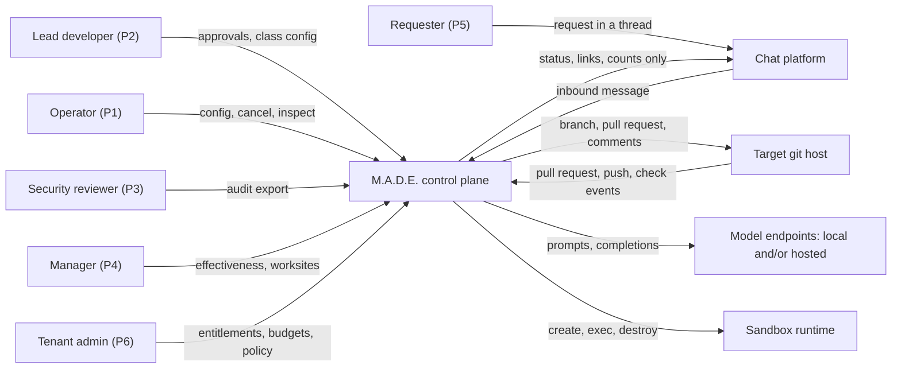
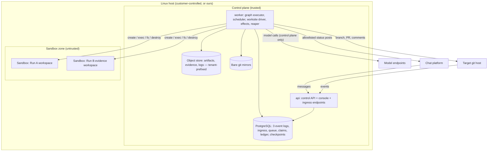
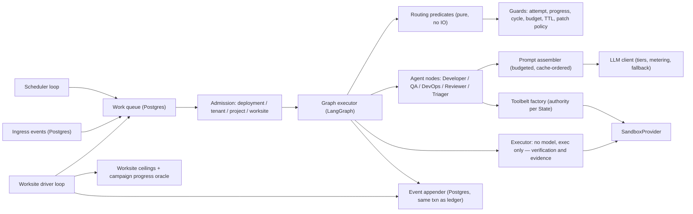

# System overview

> **Extended by the 2026-09 vision change.** The five unforgivable failures are unchanged and none has
> been weakened. What changed is that each acquired a new surface: UF-1 and UF-4 now separate tenants
> from each other rather than only a customer's code from its own host; UF-2 now has to bound a
> campaign and a reactive trigger, not only a Run; UF-3 now has to fence an entire lane that has no
> oracle; and UF-5 now has three event logs rather than one. Where a mechanism gained a surface, it is
> named below. What reversed is in
> [00-context/06-vision-change-2026-09.md](../00-context/06-vision-change-2026-09.md).

## The five unforgivable failures

Everything in this specification is shaped by five failures. These are not risks to be managed; they
are outcomes that end the project rather than annoy someone. Each names the mechanism that prevents
it, the document that specifies the mechanism, and the gate that proves it still works.

**UF-1 — Model-generated code escapes the Sandbox and reaches the host or the customer's network.**
The product is sold on the boundary. One escape at a design partner ends the company, and no feature
compensates. *Mechanism:* a kernel boundary that is not the host kernel, no credentials in the guest,
no network during verification, resource caps, and dedicated hosts.
*Specified in* [04-execution-isolation.md](04-execution-isolation.md). *Gated by*
[NFR-002](../01-product/04-non-functional-requirements.md) — the escape suite, with no tolerated
failures.
*New surface:* under hosted multi-tenancy an escape is a **cross-tenant breach** rather than a
single-customer incident, so the same boundary now separates customers from each other. Whether it is
sufficient for that is **OQ-10**, open in the direction of a stronger boundary
([18-deployment-and-tenancy.md](18-deployment-and-tenancy.md)).

**UF-2 — A Run consumes unbounded money or time.** The intake's central criticism of the incumbent
category is that a reasoning error becomes a bill. Reproducing that removes the reason to switch, and
for a bootstrapped founder it also destroys the development budget.
*Mechanism:* pre-flight budget admission, attempt caps, the progress oracle, cycle detection and a
wall-clock TTL — five independent bounds, because any one can be defeated by an unlucky model.
*Specified in* [05-orchestration-and-termination.md](05-orchestration-and-termination.md) and
[07-cost-control.md](07-cost-control.md). *Gated by*
[NFR-009](../01-product/04-non-functional-requirements.md) through
[NFR-012](../01-product/04-non-functional-requirements.md).
*New surface, and it is the largest one this revision creates:* **a worksite is a loop above every one
of those five bounds**, and **an ingress trigger spends without anybody asking**. The answer is the
same shape one level up — four declared worksite ceilings plus a campaign progress oracle
([ADR-0024](../03-adr/0024-worksites-as-long-running-campaigns.md)), four-level concurrency and spend
admission ([FR-119](../01-product/03-functional-requirements.md)), and a bounded triage allowance per
request. These are the newest and least-tested bounds in the system, sitting above the most expensive
loop.

**UF-3 — The system reports success it cannot prove.** A single false green destroys trust
permanently, because after it a reviewer must audit every line of every output, which is more work
than writing the change. This is worse than failing.
*Mechanism:* every Task carries an executable oracle declared at planning time; the exit code is the
sole determinant; model output is advisory and cannot alter a verification result.
*Specified in* [06-verification-and-truthfulness.md](06-verification-and-truthfulness.md). *Gated by*
[NFR-018](../01-product/04-non-functional-requirements.md), which asserts as a database invariant
that no Run reports success without a recorded zero exit code.
*New surface:* an entire lane now exists with **no oracle at all**. The mechanism is not a weaker
guarantee but a fence — the advisory lane is never reported in the verified vocabulary, its findings
carry evidence or an *unverified* label, its output cannot satisfy a verified gate, and effectiveness
is never blended across lanes ([ADR-0022](../03-adr/0022-two-lanes-verified-and-advisory.md),
[ADR-0023](../03-adr/0023-advisory-findings-carry-evidence.md),
[01-product/06-lanes.md](../01-product/06-lanes.md)). The failure to guard against is advisory output
borrowing the credibility of verified output, and the pressure for it will come from whoever is trying
to make a summary look tidy.
*Second new surface:* the product now reports on **its own** value, and the honest version is
uncomfortable — hence "insufficient data" rather than a percentage over three samples
([ADR-0028](../03-adr/0028-web-console-as-a-product-surface.md)).

**UF-4 — Customer source code or a secret leaves the perimeter the operator authorised.** The buyer's
security function has a veto and this is the question it asks. An unintended egress is a contract
event.
*Mechanism:* the Sandbox holds no credentials and has no network during verification; model
endpoints are explicitly configured and can be entirely local; egress decisions are recorded.
*Specified in* [13-security-and-compliance.md](13-security-and-compliance.md). *Gated by*
[NFR-005](../01-product/04-non-functional-requirements.md),
[NFR-007](../01-product/04-non-functional-requirements.md) and
[NFR-008](../01-product/04-non-functional-requirements.md).
*New surfaces:* a **chat platform** is a third party the control plane now posts to, so what may be
posted is an allowlist of status, links and counts — never source, patch content, verification output
or finding bodies ([FR-114](../01-product/03-functional-requirements.md),
[NFR-036](../01-product/04-non-functional-requirements.md)). A **tenant boundary** now sits inside the
perimeter ([NFR-029](../01-product/04-non-functional-requirements.md)). And **we hold other
organisations' source** in a hosted deployment, which is an obligation rather than a mechanism.
*Note:* air-gapped operation is no longer a supported configuration
([01-product/10-deferred-scope.md](../01-product/10-deferred-scope.md)).

**UF-5 — A Run cannot be explained after the fact.** Without a complete record, the security reviewer
cannot approve, the operator cannot debug, and a single confusing incident becomes unresolvable.
*Mechanism:* an append-only event log that is the source of truth, carrying every execution, model
call and egress decision, from which Run state is re-derivable.
*Specified in* [09-audit-and-replay.md](09-audit-and-replay.md). *Gated by*
[NFR-015](../01-product/04-non-functional-requirements.md) and
[NFR-016](../01-product/04-non-functional-requirements.md).
*New surface:* **three event logs** — Run, worksite and request — plus ingress events and git-operation
events. Every rule about the first applies to all of them: append-only, additive evolution, no
checkpoint reads on an audit path, and the effect written in the event's transaction
([FR-101](../01-product/03-functional-requirements.md),
[NFR-041](../01-product/04-non-functional-requirements.md)). This is also what let worksites carry state
across weeks without reopening the prohibition on agent memory: **rows and a log, never a model's
carried context.**

Notice what is absent: throughput, latency, breadth of language support, and success rate. Those are
product quality. Failing them makes a worse product; failing the five above makes no product.

## Design principles, as tie-breakers

Principles earn their place by resolving arguments. Each of these has decided at least one decision
in this specification, and the ordering is the priority when two conflict.

1. **The boundary is enforced, not promised.** Any control that exists only as a prompt instruction,
   a code comment or a convention is not a control. If it cannot fail a test, it does not count
   towards UF-1 or UF-4.
2. **The model proposes; the system disposes.** Agents emit typed artifacts and advisory verdicts.
   Routing, spending and success are decided by deterministic code. This is what makes termination a
   property rather than an emergent behaviour, and it is why the routing predicates are pure
   functions ([ADR-0002](../03-adr/0002-langgraph-as-executor-with-pure-routing.md)).
3. **Fail visibly and honestly.** No indefinite spinner, no unknown value defaulted to zero, no
   queued work reported as complete, no fallback presented as the real result. When the system does
   not know, it says so in those words. Every dependency has a declared degraded mode
   ([14-integrations.md](14-integrations.md)). *Extended:* a suggestion is never rendered as a proof, a
   percentage never appears without its count, and work in flight is never rendered as progress.
   Waiting is now a visible state with a position, an age and a cause, because with four trigger
   sources "nothing has happened" no longer explains itself
   ([FR-117](../01-product/03-functional-requirements.md)).
4. **One operator.** Every process, alert, dashboard and manual step is paid for out of one person's
   attention. Boring infrastructure is a correctness property here, not a preference: it is why there
   is one database, no broker, no cache and no Kubernetes. The process-kind and alert ceilings survive
   the vision change ([NFR-021](../01-product/04-non-functional-requirements.md),
   [NFR-022](../01-product/04-non-functional-requirements.md)) even though ADR-0013 itself was
   superseded ([ADR-0021](../03-adr/0021-deployment-agnostic-core-hosted-and-self-hosted.md)) — and
   they are now under more pressure, because six capabilities arrived at once.
5. **The repository is the state.** Project state lives in git and in an event log, not in an
   in-memory graph object. Anything the system knows must survive a restart and be inspectable with
   ordinary tools ([ADR-0007](../03-adr/0007-git-worktree-as-project-state.md)).
6. **Context is a budget, not a resource.** Tokens spent on irrelevant material are money spent to
   reduce accuracy. Retrieval is explicit and measured ([08-context-and-retrieval.md](08-context-and-retrieval.md)).

## Context view

The system has **four** external dependencies now: a git host, one or more model endpoints, a sandbox
runtime, and a chat platform. Each has a specified degraded mode in
[14-integrations.md](14-integrations.md). The deliberate absence of a fifth is still the point: no
managed queue, no vector service, no observability SaaS, no billing provider.

Two arrows are new and both are reversals of a stated refusal
([00-context/06-vision-change-2026-09.md](../00-context/06-vision-change-2026-09.md)): the git host now
pushes events *to* us rather than only being pushed to, and the control plane now posts *out* to a
customer-configured destination. Both were previously forbidden, both are now bounded — inbound
triggers are recorded before they act ([FR-116](../01-product/03-functional-requirements.md)) and
outbound posts are allowlisted per field and recorded as egress decisions
([FR-114](../01-product/03-functional-requirements.md)).

## Container view

Still **four long-running process kinds**, which is the ceiling
[NFR-021](../01-product/04-non-functional-requirements.md) sets — reinterpreted to count kinds rather
than processes ([ADR-0026](../03-adr/0026-resident-agents-event-ingestion-visible-queues.md)).
Everything the vision change added fits inside them: ingestion is routes on `api`; the scheduler, the
worksite driver, chat egress and the reaper are loops and handlers inside `worker`; the queue, the
claims and the three event logs are tables in `postgres`
([17-persistence-and-concurrency.md](17-persistence-and-concurrency.md)).

Three invariants in this picture carry the security story and MUST NOT be weakened without a
superseding ADR:

**Only the control plane talks to model endpoints.** A Sandbox has no model credentials and no route
to a model, so instructions injected through repository content cannot spend budget or start a nested
agent. This converts prompt injection from an open-ended threat into a bounded one.

**A Sandbox never initiates a connection to the control plane.** All communication is control plane →
Sandbox. There is no callback channel to abuse.

**Nothing is bind-mounted from the host into a Sandbox.** Files enter and leave through the narrow
provider interface ([04-execution-isolation.md](04-execution-isolation.md)), which is what makes
[NFR-003](../01-product/04-non-functional-requirements.md) checkable.

A fourth invariant is added by tenancy and it is the one whose failure is worst: **a Sandbox serves one
Run, and therefore one tenant, and is destroyed.** This was already true for Run hygiene; it now carries
tenant separation as well ([18-deployment-and-tenancy.md](18-deployment-and-tenancy.md)).

And one about ingestion: **an inbound endpoint does no work.** It authenticates, records an ingress
event, and returns. Anything that executed on the request path would be an unbounded surface driven by
somebody else's activity.

## Component view of the run worker

The seam that matters is between `GRAPH` and `ROUTE`. LangGraph executes the graph and persists
checkpoints; it does not decide anything. Every conditional edge calls a pure predicate that takes the
run state and returns a next-node name, with no IO, no clock read and no randomness. That is what
makes routing unit-testable and replayable, and it is the condition under which adopting a framework
was acceptable at all ([ADR-0002](../03-adr/0002-langgraph-as-executor-with-pure-routing.md)).

Two additions to that seam are worth naming, because both are places the purity rule can now be broken
in a new way. **The scheduler and the worksite driver evaluate time**, and they must do so by
*delivering an event* rather than by letting a predicate read a clock — a guard that computes "is this
window due" decides differently on replay. And **admission happens before the graph**, not inside it, so
that a Run that cannot proceed does not exist rather than existing and waiting invisibly.

Note also what `EXEC` is called now. It executes verification commands and advisory evidence commands
on identical terms, and it has no model. The founder's capability list names "deterministic execution"
as a role; here it is code, and that is deliberate
([16-agent-role-model.md](16-agent-role-model.md)).

## Key flows

### A successful verified Run

1. A trigger arrives — a person, a schedule window, an ingress event, or a worksite cycle — and is
   recorded as an ingress event before anything acts on it. Admission is checked at the deployment,
   tenant, project and worksite levels. The Run is created, the base commit resolved, the budget
   admitted, and `run_created` appended.
2. `SPEC` and `PLAN` are **skipped** for a work-class Run: the task template is instantiated with zero
   model calls ([FR-081](../01-product/03-functional-requirements.md)). Generated planning is deferred
   ([ADR-0020](../03-adr/0020-technical-debt-remediation-as-the-v1-product.md)); if it is ever built,
   the Architect produces a `Spec` and a `TaskGraph` here and the plan validator rejects any Task
   without a verification command.
3. `TASK_SELECT` picks the next ready Task in topological order.
4. `IMPLEMENT`: the role implied by `task.kind` produces a `Patch`; the patch policy validator and the
   applier accept or reject it; lint and syntax checks run in the Sandbox.
5. `VERIFY`: the orchestrator executes the Task's `verification_command` in the Sandbox with no
   network. The exit code decides.
6. `REVIEW`: the Reviewer comments on the diff. Advisory only.
7. Back to `TASK_SELECT` until the graph is exhausted, then `INTEGRATE` runs the full suite.
8. `AWAIT_HUMAN` for delivery approval — against the approval policy, by a principal permitted for that
   scope, lane and class — then push the branch under the reserved prefix and open a pull request.
   `DONE`.
9. If a worksite created this Run, the next cycle re-measures the progress command on the default
   branch. **The remaining count moves only when a human merges.**

### An advisory Run

1. An ingress event records that a human opened or updated a pull request.
2. `ASSESS`: the Reviewer reads the diff and the repository through read-only tools, and for each
   concern attempts an executable demonstration in its **evidence workspace** — a failing test, a
   reproduction, a benchmark. Each attempt is executed by the same executor as verification, and each
   is recorded as an evidence record, not a verification event.
3. Findings are emitted, each `demonstrated` or `unverified`. A concern with no possible demonstration
   is emitted labelled, not suppressed ([FR-149](../01-product/03-functional-requirements.md)).
4. Findings are delivered as comments on the human's pull request; evidence goes as an attached
   artifact or a branch under the reserved prefix. The reviewed branch is untouched, and no approving
   review is submitted.
5. The Run reports its findings and their evidence states. **It is never reported as verified, failed
   verification or not verified** ([FR-086](../01-product/03-functional-requirements.md)).

### A chat request

1. A message arrives in a thread; the requester's identity resolves to an entitlement, or the request
   is declined naming the missing mapping.
2. `TRIAGED`: the Triager matches the message against the entitled classes and extracts parameters,
   under a bounded triage allowance and budget admission.
3. At most a declared number of clarifying questions, in the same thread.
4. Either a Run is created from an entitled class, or the request is `DECLINED` with a reason from the
   closed set — including `requires_generated_plan`, which is how the front door tells the truth about
   its own limits ([01-product/08-chat-front-door.md](../01-product/08-chat-front-door.md)).
5. State transitions and the outcome are posted back to the thread, restricted to the allowlist.

### A Run that cannot succeed

Steps 1–6 as above, then verification fails. The progress oracle compares the new Attempt against
every previous one; if the patch hash repeats, or the failure signature repeats with no reduction in
failures, the retry is refused. Otherwise a second Attempt runs. On cap, budget exhaustion or a
detected cycle the Run enters `AWAIT_HUMAN` carrying the attempt trail. **No path in the graph retries
indefinitely, and no failure handler routes back to itself.**

### The worker dies mid-Run

The lease in `run_cursor` expires. Another worker (or the restarted one) acquires it, folds the event
log to rebuild state, and resumes from the last completed effect. Effects carry idempotency keys, so
a model call recorded as pending but unconfirmed is reconciled rather than repeated
([09-audit-and-replay.md](09-audit-and-replay.md)).

## Data ownership

Every row is additionally tenant-scoped, and the tenant is resolved from the authenticated principal
rather than from any request field ([FR-141](../01-product/03-functional-requirements.md)).

| Data | Owner | Others' access |
| --- | --- | --- |
| Run state and events | Run worker | API reads; nobody else writes |
| Worksite state and events | Worksite driver | API reads; the Run driver reads the claim, never writes it |
| Request state and events | Request broker | API reads; the chat egress handler reads what to post |
| Ingress events | API ingress endpoints | Worker reads to enqueue; nobody updates |
| Work queue and claims | Worker | API reads for the queue page; the claim is written only by the worksite driver |
| LangGraph checkpoints | Graph executor | Treated as a cache of resumable execution position, never as the audit record ([ADR-0004](../03-adr/0004-event-log-separate-from-checkpoints.md)) |
| Artifacts, including evidence records | Run worker writes once, immutable | API and agents read by digest, within a tenant prefix |
| Workspace files | Sandbox, for the Run's lifetime | Control plane reads through the provider interface only |
| Cost ledger | LLM client, in the event transaction | API reads |
| Effectiveness figures | **Nobody — they are derived** | Computed on read from the event logs by published queries ([FR-131](../01-product/03-functional-requirements.md)). There is deliberately no rollup table, because a second source of truth for the product's headline number is a trust failure |
| Entitlements, approval policy, budgets | Tenant administrator, versioned | Admission and routing read; every change is an event |
| Secrets | Host secret store | Control plane reads; Sandboxes never |

## Failure modes and responses

| Failure | Detection | Response | Degraded mode |
| --- | --- | --- | --- |
| Model endpoint unavailable | Provider error or timeout | Fail over to the tier's configured fallback, recorded on the call | If both are down, Run parks in `AWAIT_HUMAN` with reason `provider_unavailable`. Never silently substitute a different tier. |
| Sandbox runtime unavailable | Pre-flight check at Run start | Refuse the Run | Explicit refusal naming the failed check. Never fall back to a weaker runtime ([FR-055](../01-product/03-functional-requirements.md)). |
| Postgres unavailable | Connection failure | API returns 503; worker stops advancing Runs | Runs are frozen, not lost. No execution proceeds without a durable event, because an unlogged action violates UF-5. |
| Object store unavailable | Write failure | Fail the current State, retry with backoff, then park | Artifacts are never dropped to "keep going"; a Run without its artifacts is unauditable. |
| Git host unavailable | Push or API failure | Park in `AWAIT_HUMAN` with reason `delivery_failed`; the branch remains local | Work is preserved and re-deliverable; never reported as delivered. |
| Verification command hangs | Per-exec timeout | Kill, record a timeout as a failed Attempt with its own signature | Counts as an Attempt; does not stall the Run. |
| Sandbox leaked by a dead worker | Reaper sweep on idle timeout | Destroy | Cost bounded; recorded as an event. |
| Disk full on host | Monitored threshold | Refuse new Runs, alert | Existing Runs finish or park; no silent artifact loss. |
| **Ingestion stops** | No ingress events while the deployment is up | Alert | **The quietest failure in the system**: nothing breaks, work simply does not happen. Needs one of the eight alert slots ([17-persistence-and-concurrency.md](17-persistence-and-concurrency.md)). |
| **Chat platform unavailable** | Post failure | Bounded retry, then record the egress decision as failed | Runs and requests are unaffected. A request is **never** reported as answered when the post failed — the same rule as delivery. |
| **Repository access revoked or insufficient** | Authorisation status on a git operation | Park affected Runs with `access_revoked` or `access_insufficient`; release worksite claims | No retry, no fallback credential, no alternative ref, no degraded delivery ([FR-125](../01-product/03-functional-requirements.md), [FR-126](../01-product/03-functional-requirements.md)). |
| **Worksite not reducing its remaining count** | Campaign progress oracle | Pause and escalate, distinguishing failed slices from unmerged pull requests | Bounded spend; no ceiling may be raised while active. |
| **Two worksites want the same paths** | Claim overlap at activation | The second waits, visibly, with the blocking claim and the wait's age | Blocks work the system could do — the deliberate alternative to silent conflicts. |
| **Queue at its bound** | Queue depth metric | Shed with a recorded reason per item | Work is refused visibly rather than accumulating. |
| **One tenant starves another** | Per-tenant queue wait at p95 | Per-tenant concurrency cap bounds it | Bounded, **not eliminated**. The honest weak point ([17-persistence-and-concurrency.md](17-persistence-and-concurrency.md)). |

## Scale envelope

A self-hosted deployment targets one host, up to 4 concurrent Runs, a Project count in the tens, and a
Run duration of minutes. Target repositories are assumed to be up to roughly 100k lines and 5k files —
the repo map and retrieval design ([08-context-and-retrieval.md](08-context-and-retrieval.md)) is what
makes repository size largely irrelevant to cost, but indexing time is not zero and this is the tested
range.

Three envelopes the vision change added, and all three are **unmeasured**:

**Worksite duration is weeks and cycle counts are in the tens.** A worksite is the first entity whose
lifetime exceeds a deploy, so every restart, upgrade and migration happens *during* one.

**Ingress volume is set by somebody else's activity**, not by us. A busy organisation opens pull
requests faster than a schedule fires, which is why the queue is bounded and sheds rather than grows.

**Tenant count in a hosted deployment is unknown**, and the binding constraint there is likely to be
Sandbox concurrency shared across tenants rather than any single tenant's load — which is where
fairness stops being theoretical.

The first constraint to bind will still be Sandbox concurrency (CPU and memory on one host), not
Postgres or the API. The scaling path — more worker processes against the same database, then a
separate sandbox host pool — is in
[11-infrastructure-and-devops.md](11-infrastructure-and-devops.md), and the lease mechanism already
permits the first step. **What it does not permit is fairness between tenants**, which is the part that
would need real design ([ADR-0026](../03-adr/0026-resident-agents-event-ingestion-visible-queues.md)).

**OQ-13** asks what scale v1 targets — one repository, or many repositories across many teams — and
nothing here should be read as an answer.

## Rejected architectures

Each of these is a real option, presented as its strongest self, with the reason it lost. The costs
of the chosen path are recorded in the relevant ADR.

**Conversation-driven multi-agent orchestration (AutoGen-style).** Its strength is genuine: agents
negotiating in natural language handle ambiguity and novel situations that a fixed graph cannot, and
it is far faster to prototype. Rejected because termination becomes emergent — the system stops when
the agents agree they are finished, which is exactly the property UF-2 forbids — and because there is
no natural place to attach a budget or an attempt cap. A conversation cannot be replayed into a
deterministic state, which also forfeits UF-5.

**A hand-written state machine with no graph framework.** Strong case: roughly a few hundred lines,
zero dependency surface, total control over persistence and migration, and no framework abstraction
between the code and the behaviour. It was the recommendation of an earlier draft of this
architecture. It lost to [ADR-0002](../03-adr/0002-langgraph-as-executor-with-pure-routing.md) on
three grounds: LangGraph supplies durable checkpointing and a first-class human-interrupt mechanism
that we would otherwise write and debug ourselves; the intake names it as the intended framework and
the founder's learning curve is a real cost; and the property we actually need — deterministic
routing — is obtainable by keeping the predicates pure, which the framework permits. The cost of that
choice is recorded in the ADR and is not small.

**Durable-execution engine (Temporal) as the backbone.** Strongest case in the set: it gives exactly
the guarantees UF-2 and UF-5 want — deterministic replay, per-activity retries and timeouts, durable
timers, signals for human approval, and an audit log as a by-product. Rejected for v1 on operational
cost against principle 4: a self-hosted Temporal cluster is a second system to operate for one
person, and Temporal Cloud is a hosted dependency an air-gapped customer cannot use. Because
`decide`-style routing is already pure and IO already sits in effect handlers, adopting it later is
mechanical. The revisit trigger is in [ADR-0002](../03-adr/0002-langgraph-as-executor-with-pure-routing.md).

**Containers-only isolation (`runc`) with a strong seccomp profile.** Its case is real: near-zero
overhead, no additional runtime to install, and the majority of the industry runs untrusted-ish
workloads this way. Rejected because a kernel privilege-escalation vulnerability becomes a host
compromise, and the host here is the customer's virtualisation node. Against UF-1 no amount of
profile hardening changes the shared-kernel fact, and the product's differentiator is precisely that
it does not make this trade.

**Microservice per agent role.** The case: independent scaling and blast-radius isolation per role.
Rejected because roles are prompts plus tool grants, not workloads with different scaling
characteristics; splitting them would triple the operational surface for one operator and introduce
network failure modes between components that share a transaction today
([16-agent-role-model.md](16-agent-role-model.md)).

**Long-lived per-role agent processes holding context — the literal reading of "a swarm that lives in
your infrastructure".** This is the strongest rejected option added by the 2026-09 vision change, and
its case is not weak: an agent that stays resident builds genuine familiarity with a codebase — which
modules are fragile, which tests are flaky, which patterns the team prefers — and rediscovering that
per Run is plausibly where the largest available quality gain in this whole system sits. It is also
what the founder's phrasing most naturally means.

Rejected because a resident agent's behaviour depends on state that is in no event log, so "why did it
do that" becomes unanswerable and a Run stops being explainable from its own record, which is
[UF-5](#the-five-unforgivable-failures) and is a v1 gate rather than a preference. A process that
decides for itself when to act also has no admission-control point. Residency is therefore delivered by
the control plane — durable ingestion, durable schedules, visible queues — and agents stay stateless
([ADR-0026](../03-adr/0026-resident-agents-event-ingestion-visible-queues.md)). The knowledge argument
is answered only partially, by accumulating learning in the evaluation corpus and in attempt records
where it is inspectable, and that is the trade being made rather than a refutation.

**A message broker for ingestion, scheduling and backpressure.** The conventional answer at the volume
hosted multi-tenancy implies, and it supplies delivery semantics, retries, dead-lettering and fairness
for free — including the tenant fairness a Postgres queue does worst. Rejected because every effect in
this system is written in the same transaction as its event, and a broker outside the database cannot
participate in that transaction: adopting one means either weakening the audit guarantee or writing a
two-phase reconciliation that is more work than the queue table. The revisit trigger is a measurement
([ADR-0026](../03-adr/0026-resident-agents-event-ingestion-visible-queues.md)).

**A per-finding confidence score instead of a two-state evidence label.** The case: reviewers
understand gradations, and a number carries more information than a binary. Rejected because a score is
a model output and this architecture's central rule is that a model's opinion never decides anything.
`demonstrated` is a recorded exit code; `0.8` is a feeling, it looks like a measurement, and it invites
averaging ([ADR-0023](../03-adr/0023-advisory-findings-carry-evidence.md)).

**A separate product for advisory work, with its own deployment and interface.** The cleanest possible
guarantee that the two lanes never contaminate each other's reporting. Rejected because it doubles the
operational surface for one maintainer, forfeits the machinery the advisory lane genuinely needs —
sandboxed execution to produce evidence, budget ceilings, the audit trail — and because the separation
required is a boundary inside one system, which is testable in one test suite
([ADR-0022](../03-adr/0022-two-lanes-verified-and-advisory.md)).

**A worksite as one very long Run.** No new entity, no new event log, no new ceilings, and every
existing guard applies unmodified — a campaign is "just" a task graph with four hundred Tasks. Rejected
because the TTL and budget ceiling would have to grow until they stop bounding anything, delivery is
per Run so it would produce one unreviewable pull request, and failure attribution across hundreds of
Tasks collapses ([ADR-0024](../03-adr/0024-worksites-as-long-running-campaigns.md)).

**Everything in the graph state, including file contents.** The intake proposes a `project_structure`
dictionary holding file paths mapped to source. Its appeal is simplicity: one object, no external
state. Rejected in [ADR-0007](../03-adr/0007-git-worktree-as-project-state.md) because it puts the
entire codebase into every checkpoint and, in practice, into prompts; because reducers merging
concurrent file writes reimplement version control badly; and because it makes the workspace
unreviewable by a human with ordinary tools. Git already solves this and produces the artifact the
reviewer wants.
