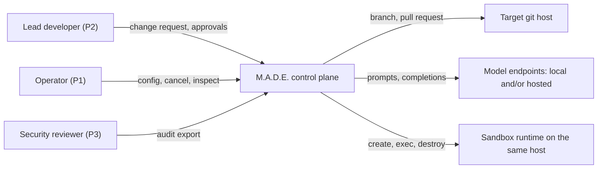
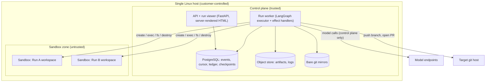
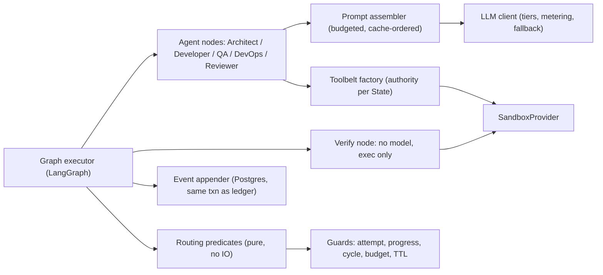

# System overview

## The five unforgivable failures

Everything in this specification is shaped by five failures. These are not risks to be managed; they
are outcomes that end the project rather than annoy someone. Each names the mechanism that prevents
it, the document that specifies the mechanism, and the gate that proves it still works.

**UF-1 — Model-generated code escapes the Sandbox and reaches the host or the customer's network.**
The product is sold on the boundary. One escape at a design partner ends the company, and no feature
compensates. *Mechanism:* a kernel boundary that is not the host kernel, no credentials in the guest,
no network during verification, resource caps, and dedicated hosts.
*Specified in* [04-execution-isolation.md](04-execution-isolation.md). *Gated by*
[NFR-002](../01-product/04-non-functional-requirements.md) — the escape suite, with no tolerated
failures.

**UF-2 — A Run consumes unbounded money or time.** The intake's central criticism of the incumbent
category is that a reasoning error becomes a bill. Reproducing that removes the reason to switch, and
for a bootstrapped founder it also destroys the development budget.
*Mechanism:* pre-flight budget admission, attempt caps, the progress oracle, cycle detection and a
wall-clock TTL — five independent bounds, because any one can be defeated by an unlucky model.
*Specified in* [05-orchestration-and-termination.md](05-orchestration-and-termination.md) and
[07-cost-control.md](07-cost-control.md). *Gated by*
[NFR-009](../01-product/04-non-functional-requirements.md) through
[NFR-012](../01-product/04-non-functional-requirements.md).

**UF-3 — The system reports success it cannot prove.** A single false green destroys trust
permanently, because after it a reviewer must audit every line of every output, which is more work
than writing the change. This is worse than failing.
*Mechanism:* every Task carries an executable oracle declared at planning time; the exit code is the
sole determinant; model output is advisory and cannot alter a verification result.
*Specified in* [06-verification-and-truthfulness.md](06-verification-and-truthfulness.md). *Gated by*
[NFR-018](../01-product/04-non-functional-requirements.md), which asserts as a database invariant
that no Run reports success without a recorded zero exit code.

**UF-4 — Customer source code or a secret leaves the perimeter the operator authorised.** The buyer's
security function has a veto and this is the question it asks. An unintended egress is a contract
event and, for an air-gapped customer, a disqualifying one.
*Mechanism:* the Sandbox holds no credentials and has no network during verification; model
endpoints are explicitly configured and can be entirely local; egress decisions are recorded.
*Specified in* [13-security-and-compliance.md](13-security-and-compliance.md). *Gated by*
[NFR-005](../01-product/04-non-functional-requirements.md),
[NFR-007](../01-product/04-non-functional-requirements.md) and
[NFR-008](../01-product/04-non-functional-requirements.md).

**UF-5 — A Run cannot be explained after the fact.** Without a complete record, the security reviewer
cannot approve, the operator cannot debug, and a single confusing incident becomes unresolvable.
*Mechanism:* an append-only event log that is the source of truth, carrying every execution, model
call and egress decision, from which Run state is re-derivable.
*Specified in* [09-audit-and-replay.md](09-audit-and-replay.md). *Gated by*
[NFR-015](../01-product/04-non-functional-requirements.md) and
[NFR-016](../01-product/04-non-functional-requirements.md).

Notice what is absent: throughput, latency, breadth of language support, and success rate. Those are
product quality. Failing them makes a worse product; failing the five above makes no product.

## Design principles, as tie-breakers

Principles earn their place by resolving arguments. Each of these has decided at least one decision
in this specification, and the ordering is the priority when two conflict.

1. **The boundary is enforced, not promised.** Any control that exists only as a prompt instruction,
   a code comment or a convention is not a control. If it cannot fail a test, it does not count
   towards UF-1 or UF-4.
2. **The model proposes; the system disposes.** Agents emit typed artifacts and advisory verdicts.
   Routing, spending and success are decided by deterministic code. This is what makes termination a
   property rather than an emergent behaviour, and it is why the routing predicates are pure
   functions ([ADR-0002](../03-adr/0002-langgraph-as-executor-with-pure-routing.md)).
3. **Fail visibly and honestly.** No indefinite spinner, no unknown value defaulted to zero, no
   queued work reported as complete, no fallback presented as the real result. When the system does
   not know, it says so in those words. Every dependency has a declared degraded mode
   ([14-integrations.md](14-integrations.md)).
4. **One operator.** Every process, alert, dashboard and manual step is paid for out of one person's
   attention. Boring infrastructure is a correctness property here, not a preference: it is why there
   is one database and no queue, no cache and no Kubernetes ([ADR-0013](../03-adr/0013-single-tenant-self-hosted-v1.md)).
5. **The repository is the state.** Project state lives in git and in an event log, not in an
   in-memory graph object. Anything the system knows must survive a restart and be inspectable with
   ordinary tools ([ADR-0007](../03-adr/0007-git-worktree-as-project-state.md)).
6. **Context is a budget, not a resource.** Tokens spent on irrelevant material are money spent to
   reduce accuracy. Retrieval is explicit and measured ([08-context-and-retrieval.md](08-context-and-retrieval.md)).

## Context view

The system has exactly three external dependencies — a git host, one or more model endpoints, and a
sandbox runtime. Each has a specified degraded mode in [14-integrations.md](14-integrations.md). The
deliberate absence of a fourth is the point: no managed queue, no vector service, no observability
SaaS, no billing provider.

## Container view

Four long-running processes, which is the ceiling [NFR-021](../01-product/04-non-functional-requirements.md)
sets. Three invariants in this picture carry the security story and MUST NOT be weakened without a
superseding ADR:

**Only the control plane talks to model endpoints.** A Sandbox has no model credentials and no route
to a model, so instructions injected through repository content cannot spend budget or start a nested
agent. This converts prompt injection from an open-ended threat into a bounded one.

**A Sandbox never initiates a connection to the control plane.** All communication is control plane →
Sandbox. There is no callback channel to abuse.

**Nothing is bind-mounted from the host into a Sandbox.** Files enter and leave through the narrow
provider interface ([04-execution-isolation.md](04-execution-isolation.md)), which is what makes
[NFR-003](../01-product/04-non-functional-requirements.md) checkable.

## Component view of the run worker

The seam that matters is between `GRAPH` and `ROUTE`. LangGraph executes the graph and persists
checkpoints; it does not decide anything. Every conditional edge calls a pure predicate that takes the
run state and returns a next-node name, with no IO, no clock read and no randomness. That is what
makes routing unit-testable and replayable, and it is the condition under which adopting a framework
was acceptable at all ([ADR-0002](../03-adr/0002-langgraph-as-executor-with-pure-routing.md)).

## Key flows

### A successful Run

1. `POST /v1/runs` creates the Run, resolves the base commit, admits the budget, and appends
   `run_created`.
2. `SPEC`: the Architect reads the repo map and produces a `Spec`.
3. `PLAN`: the Architect produces a `TaskGraph`. The plan validator rejects any Task without a
   verification command. If plan approval is on, the Run parks in `AWAIT_HUMAN`.
4. `TASK_SELECT` picks the next ready Task in topological order.
5. `IMPLEMENT`: the role implied by `task.kind` produces a `Patch`; the patch policy validator and the
   applier accept or reject it; lint and syntax checks run in the Sandbox.
6. `VERIFY`: the orchestrator executes the Task's `verification_command` in the Sandbox with no
   network. The exit code decides.
7. `REVIEW`: the Reviewer comments on the diff. Advisory only.
8. Back to `TASK_SELECT` until the graph is exhausted, then `INTEGRATE` runs the full suite.
9. `AWAIT_HUMAN` for delivery approval, then push the branch and open a pull request. `DONE`.

### A Run that cannot succeed

Steps 1–6 as above, then verification fails. The progress oracle compares the new Attempt against
every previous one; if the patch hash repeats, or the failure signature repeats with no reduction in
failures, the retry is refused. Otherwise a second Attempt runs. On cap, budget exhaustion or a
detected cycle the Run enters `AWAIT_HUMAN` carrying the attempt trail. **No path in the graph retries
indefinitely, and no failure handler routes back to itself.**

### The worker dies mid-Run

The lease in `run_cursor` expires. Another worker (or the restarted one) acquires it, folds the event
log to rebuild state, and resumes from the last completed effect. Effects carry idempotency keys, so
a model call recorded as pending but unconfirmed is reconciled rather than repeated
([09-audit-and-replay.md](09-audit-and-replay.md)).

## Data ownership

| Data | Owner | Others' access |
| --- | --- | --- |
| Run state and events | Run worker | API reads; nobody else writes |
| LangGraph checkpoints | Graph executor | Treated as a cache of resumable execution position, never as the audit record ([ADR-0004](../03-adr/0004-event-log-separate-from-checkpoints.md)) |
| Artifacts | Run worker writes once, immutable | API and agents read by digest |
| Workspace files | Sandbox, for the Run's lifetime | Control plane reads through the provider interface only |
| Cost ledger | LLM client, in the event transaction | API reads |
| Secrets | Host secret store | Control plane reads; Sandboxes never |

## Failure modes and responses

| Failure | Detection | Response | Degraded mode |
| --- | --- | --- | --- |
| Model endpoint unavailable | Provider error or timeout | Fail over to the tier's configured fallback, recorded on the call | If both are down, Run parks in `AWAIT_HUMAN` with reason `provider_unavailable`. Never silently substitute a different tier. |
| Sandbox runtime unavailable | Pre-flight check at Run start | Refuse the Run | Explicit refusal naming the failed check. Never fall back to a weaker runtime ([FR-055](../01-product/03-functional-requirements.md)). |
| Postgres unavailable | Connection failure | API returns 503; worker stops advancing Runs | Runs are frozen, not lost. No execution proceeds without a durable event, because an unlogged action violates UF-5. |
| Object store unavailable | Write failure | Fail the current State, retry with backoff, then park | Artifacts are never dropped to "keep going"; a Run without its artifacts is unauditable. |
| Git host unavailable | Push or API failure | Park in `AWAIT_HUMAN` with reason `delivery_failed`; the branch remains local | Work is preserved and re-deliverable; never reported as delivered. |
| Verification command hangs | Per-exec timeout | Kill, record a timeout as a failed Attempt with its own signature | Counts as an Attempt; does not stall the Run. |
| Sandbox leaked by a dead worker | Reaper sweep on idle timeout | Destroy | Cost bounded; recorded as an event. |
| Disk full on host | Monitored threshold | Refuse new Runs, alert | Existing Runs finish or park; no silent artifact loss. |

## Scale envelope

v1 targets one host, up to 4 concurrent Runs, a Project count in the tens, and a Run duration of
minutes. Target repositories are assumed to be up to roughly 100k lines and 5k files — the repo map
and retrieval design ([08-context-and-retrieval.md](08-context-and-retrieval.md)) is what makes
repository size largely irrelevant to cost, but indexing time is not zero and this is the tested
range.

The first constraint to bind will be Sandbox concurrency (CPU and memory on one host), not Postgres
or the API. The scaling path — more workers against the same database, then a separate sandbox host
pool — is in [11-infrastructure-and-devops.md](11-infrastructure-and-devops.md), and the lease
mechanism is already designed to permit it.

## Rejected architectures

Each of these is a real option, presented as its strongest self, with the reason it lost. The costs
of the chosen path are recorded in the relevant ADR.

**Conversation-driven multi-agent orchestration (AutoGen-style).** Its strength is genuine: agents
negotiating in natural language handle ambiguity and novel situations that a fixed graph cannot, and
it is far faster to prototype. Rejected because termination becomes emergent — the system stops when
the agents agree they are finished, which is exactly the property UF-2 forbids — and because there is
no natural place to attach a budget or an attempt cap. A conversation cannot be replayed into a
deterministic state, which also forfeits UF-5.

**A hand-written state machine with no graph framework.** Strong case: roughly a few hundred lines,
zero dependency surface, total control over persistence and migration, and no framework abstraction
between the code and the behaviour. It was the recommendation of an earlier draft of this
architecture. It lost to [ADR-0002](../03-adr/0002-langgraph-as-executor-with-pure-routing.md) on
three grounds: LangGraph supplies durable checkpointing and a first-class human-interrupt mechanism
that we would otherwise write and debug ourselves; the intake names it as the intended framework and
the founder's learning curve is a real cost; and the property we actually need — deterministic
routing — is obtainable by keeping the predicates pure, which the framework permits. The cost of that
choice is recorded in the ADR and is not small.

**Durable-execution engine (Temporal) as the backbone.** Strongest case in the set: it gives exactly
the guarantees UF-2 and UF-5 want — deterministic replay, per-activity retries and timeouts, durable
timers, signals for human approval, and an audit log as a by-product. Rejected for v1 on operational
cost against principle 4: a self-hosted Temporal cluster is a second system to operate for one
person, and Temporal Cloud is a hosted dependency an air-gapped customer cannot use. Because
`decide`-style routing is already pure and IO already sits in effect handlers, adopting it later is
mechanical. The revisit trigger is in [ADR-0002](../03-adr/0002-langgraph-as-executor-with-pure-routing.md).

**Containers-only isolation (`runc`) with a strong seccomp profile.** Its case is real: near-zero
overhead, no additional runtime to install, and the majority of the industry runs untrusted-ish
workloads this way. Rejected because a kernel privilege-escalation vulnerability becomes a host
compromise, and the host here is the customer's virtualisation node. Against UF-1 no amount of
profile hardening changes the shared-kernel fact, and the product's differentiator is precisely that
it does not make this trade.

**Microservice per agent role.** The case: independent scaling and blast-radius isolation per role.
Rejected because roles are prompts plus tool grants, not workloads with different scaling
characteristics; splitting them would triple the operational surface for one operator and introduce
network failure modes between components that share a transaction today.

**Everything in the graph state, including file contents.** The intake proposes a `project_structure`
dictionary holding file paths mapped to source. Its appeal is simplicity: one object, no external
state. Rejected in [ADR-0007](../03-adr/0007-git-worktree-as-project-state.md) because it puts the
entire codebase into every checkpoint and, in practice, into prompts; because reducers merging
concurrent file writes reimplement version control badly; and because it makes the workspace
unreviewable by a human with ordinary tools. Git already solves this and produces the artifact the
reviewer wants.
