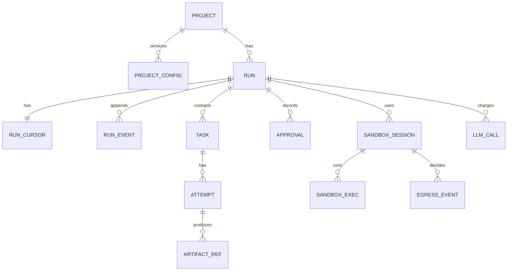

# Data model

The normative schema is [`/contracts/db/0001_init.sql`](../../contracts/db/0001_init.sql). This
document explains the entities, the invariants the schema enforces, and the query rules that are not
expressible as constraints. Where this text and the DDL disagree, the DDL wins and this document is a
bug.

The database is PostgreSQL and it is the system of record
([ADR-0003](../03-adr/0003-postgres-as-system-of-record.md)). It holds three kinds of data that must
not be confused: the **append-only event log**, which is the truth; **derived state**, which exists
so that common queries do not fold the log; and the **execution checkpoints** written by the graph
framework, which are a resumption cache and never an audit source
([ADR-0004](../03-adr/0004-event-log-separate-from-checkpoints.md)).

## Entities

**Project** — a registered target repository plus the settings Runs inherit. Mutable settings live in
**project_config**, which is versioned and immutable per version, because a Run must be explainable
against the configuration it actually executed under
([FR-005](../01-product/03-functional-requirements.md)). Changing a budget must not silently rewrite
the meaning of last week's Run.

**Run** — one execution of the state machine. Carries the base commit, branch name, budget ceiling,
current State, spend and terminal reason. A Run's row is derived state: it can be rebuilt by folding
`run_event`.

**run_cursor** — one row per Run holding the execution lease and the fast-path current State and
spend. Separated from `runs` because it is written on every step and read by the lease acquisition
path; keeping the hot row narrow keeps the append path within
[NFR-017](../01-product/04-non-functional-requirements.md).

**run_event** — the append-only log. `(run_id, seq)` is the primary key and `seq` is dense from 1.
Every event carries the State it occurred in, an optional Task, an optional artifact digest, and the
cost it incurred. Cost lives on the event and not only in the ledger so that a fold reproduces spend
without joining ([NFR-016](../01-product/04-non-functional-requirements.md)).

**Task** — a unit of work from the TaskGraph, with `kind`, `verification_command`, budget, attempt
cap and dependency list. `verification_command` is written once at plan acceptance and is never
updated; that immutability is the schema-level half of
[FR-034](../01-product/03-functional-requirements.md).

**Attempt** — one Implement-and-Verify pass. Holds the patch digest, the verification exit code, the
`failure_signature`, the failing count and the normalised output digest. The progress oracle reads
this table and nothing else, which is what makes it testable in isolation.

**Artifact** — content-addressed immutable output. The row holds `sha256`, `kind`, `schema_version`,
size and storage location; the bytes live in the object store
([ADR-0017](../03-adr/0017-content-addressed-artifact-store.md)).

**llm_call** — one row per model call with tokens, cached tokens, cost, latency, provider, model,
prompt version, tier, fallback flag and an idempotency key. Written in the same transaction as its
event.

**sandbox_session** and **sandbox_exec** — the lifecycle of a Sandbox and every process executed
inside it, including argv, exit code, duration and output digest. This is the table a security
reviewer reads.

**egress_event** — every network decision made on behalf of a Run, allowed or denied, with
destination and reason.

**Approval** — an immutable record of a human decision: actor, decision, reason, the State it
unblocked and the artifact digests the human saw. Recording what was shown matters: an approval of a
plan the human never actually saw is not an approval.

## Invariants

Enforced in the schema where possible, asserted nightly where not. Each is checkable with SQL, which
is deliberate — an invariant that requires application code to verify is one that stops being
verified.

| ID | Invariant | Enforcement |
| --- | --- | --- |
| INV-1 | `run_event` rows are never updated or deleted. `seq` is dense and gapless per Run. | No UPDATE/DELETE grant on the table for the application role; a nightly gap query |
| INV-2 | A Run in `DONE` has every Task in `TASK_DONE`, and every one of those Tasks has at least one Attempt with `verification_exit_code = 0`. | Nightly invariant query; this is the SQL form of [NFR-018](../01-product/04-non-functional-requirements.md) |
| INV-3 | `run_cursor.spent_usd` equals the sum of that Run's `llm_call.cost_usd`, to within the rounding tolerance of the numeric type. | Same-transaction write plus a nightly reconciliation |
| INV-4 | A Task has no more Attempts than its `max_attempts`, and a Run has no more than its total cap. | Application guard plus a `CHECK` on `attempt_no`, plus nightly query |
| INV-5 | An `artifact` row's `sha256` matches the stored bytes, and no row is ever rewritten. | Digest verified on read; no UPDATE grant |
| INV-6 | At most one non-expired lease exists per Run. | `run_cursor.lease_until` compared under row lock; conditional UPDATE |
| INV-7 | Every `sandbox_session` belonging to a terminal Run has `destroyed_at` set. | Reaper plus nightly query; a violation means a leaked Sandbox and is alertable |
| INV-8 | Every `llm_call` and every `sandbox_exec` has a corresponding `run_event`. | Nightly reconciliation; this is [NFR-015](../01-product/04-non-functional-requirements.md) |
| INV-9 | A Run's `project_config_version` never changes after creation. | Column is written once; no UPDATE path in application code, asserted by test |

## Lifecycle state machines

The Run lifecycle is the state machine in
[`/contracts/state-machine.json`](../../contracts/state-machine.json), described in
[05-orchestration-and-termination.md](05-orchestration-and-termination.md). The database stores the
current State as a string constrained by a `CHECK` to the same enumeration; a spec-lint job asserts
the two lists are identical, because a divergence between the contract and the schema is a class of
bug that silently disables transitions.

Two subordinate lifecycles are worth stating because they are easy to get wrong:

**Task:** `PENDING → RUNNING → (DONE | FAILED)`. A Task never returns from `DONE` or `FAILED`. A
replan produces new Tasks with new identifiers rather than reopening old ones, so the attempt history
of a failed approach is preserved rather than overwritten.

**Sandbox session:** `REQUESTED → READY → (DESTROYED)`. There is no reuse state. A Sandbox serves one
Run and is destroyed; resurrection is not modelled because it would require reasoning about residue
from a previous tenant, which is exactly the reasoning UF-1 avoids.

## Query rules

Rules that constraints cannot express and that an agent will otherwise get wrong.

**Read `run_cursor` for current State, never the latest `run_event`.** Deriving state by taking the
last event ignores events that do not change state (a cost charge, an exec record) and produces a
wrong answer intermittently — the worst kind of bug to find.

**Fold events only for replay and audit, never on a request path.** Folding is O(events) and events
are unbounded; the API must answer from derived tables. Replay is a separate, deliberate operation
([09-audit-and-replay.md](09-audit-and-replay.md)).

**Never join `run_events` to compute cost.** Use `llm_calls`, which is indexed for it. The cost on the
event exists for fold fidelity, not for aggregation, and summing the event column will double-count
if an event is ever written for a reconciliation.

**Attempt ordering is `(task_id, attempt_no)`, not `created_at`.** Clock skew and retries make
timestamps unreliable for ordering, and the progress oracle's correctness depends on comparing
against *all* previous Attempts in order.

**Paginate `run_events` by `seq`, never by offset.** Offset pagination over an appending table skips
rows. The API contract exposes a `seq` cursor for this reason
([03-api-design.md](03-api-design.md)).

**Every write that spends money or executes code happens in the same transaction as its event.** If
these can diverge, the ledger and the audit log stop agreeing, and UF-5 fails quietly.

## Indexing strategy

Sized for the actual access patterns, not for hypothetical scale. Over-indexing an append-heavy table
costs write latency, which is the one latency budget this system has.

| Index | Serves |
| --- | --- |
| `run_events (run_id, seq)` — primary key | Fold, pagination, export |
| `run_events (run_id, kind)` partial on audit kinds | Security-reviewer queries filtering to executions and model calls |
| `runs (project_id, created_at desc)` | Run list in the viewer |
| `runs (state)` partial where state not terminal | Worker scan for resumable Runs and the lease sweep |
| `run_cursor (lease_until)` partial where lease is set | Reaper and lease expiry sweep |
| `tasks (run_id, position)` | Topological selection |
| `attempts (task_id, attempt_no)` — unique | Progress oracle; also enforces INV-4 |
| `attempts (task_id, failure_signature)` | Progress oracle's repeat-signature lookup |
| `llm_calls (run_id)`, `llm_calls (idempotency_key)` unique | Ledger aggregation and exactly-once reconciliation |
| `sandbox_execs (session_id, started_at)` | Audit export |
| `artifacts (sha256)` — primary key | Content addressing and deduplication |

Deliberately **not** indexed: free-text search over event payloads, artifact contents, or prompt text.
Those queries are rare, run by a human, and adding a full-text index to an append-hot table trades a
constant write cost for an occasional read convenience.

## What the schema deliberately omits

**No `users` table.** v1 is single-tenant with API keys mapped to a role
([ADR-0013](../03-adr/0013-single-tenant-self-hosted-v1.md)). Approvals record an actor string taken
from the authenticated key. A user model with profiles and sessions would be built for a
multi-tenancy that does not exist yet.

**No `tenants` column.** Adding a nullable tenant column now would create the illusion of isolation
without any enforcement, which is worse than its absence. The migration path is specified in
[15-future-phase-seams.md](15-future-phase-seams.md).

**No soft deletes.** Nothing is deleted; Projects are archived and Runs are retained. A `deleted_at`
column invites queries that forget to filter it, and in an audit system a hidden row is a lie.

**No `updated_at` on `run_events`, `attempts` or `artifacts`.** These are immutable. A column implying
mutability invites an UPDATE.

**No file contents in the database.** Source lives in git; artifacts live in the object store keyed by
digest ([ADR-0017](../03-adr/0017-content-addressed-artifact-store.md)). Large blobs in Postgres
inflate backups and WAL for data that is already content-addressed elsewhere.

**No embeddings or vector columns.** [ADR-0009](../03-adr/0009-tool-mediated-retrieval-no-vector-db.md)
rejects vector retrieval for v1; a column would be an invitation to build it.

**No aggregate/rollup tables.** Run counts are small enough that aggregation is a query. A materialised
rollup would be a second source of truth for cost, and cost disagreement is a trust failure.
