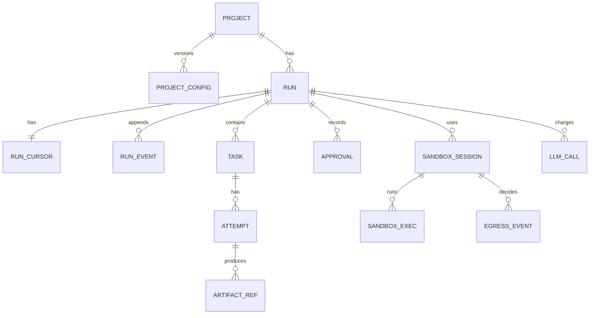

# Data model

The normative schema is [`/contracts/db/0001_init.sql`](../../contracts/db/0001_init.sql). This
document explains the entities, the invariants the schema enforces, and the query rules that are not
expressible as constraints. Where this text and the DDL disagree, the DDL wins and this document is a
bug.

> **The DDL currently disagrees, and this document is not the bug.** The 2026-09 vision change added
> entities — tenant, worksite, request, finding, evidence record, ingress event, work queue, claim,
> user, team — that [`/contracts/db/0001_init.sql`](../../contracts/db/0001_init.sql) does not contain,
> and added `tenant_id` to tables that do not have it. Under the source-of-truth hierarchy the contract
> wins, so **everything in the "Added by the 2026-09 vision change" sections below describes something
> with no normative form yet.**
>
> That is recorded rather than resolved here for a specific reason: a contract change lands **alone and
> first**, in its own pull request with its schema tests
> ([ADR-0018](../03-adr/0018-spec-as-contract-and-spec-lint.md)), and a documentation pull request that
> also rewrote the DDL would be exactly the batching that rule forbids. The contract-only backlog items
> are enumerated in [05-delivery/02-backlog.md](../05-delivery/02-backlog.md), and **no implementation
> item for a new entity is startable until they land.**

The database is PostgreSQL and it is the system of record
([ADR-0003](../03-adr/0003-postgres-as-system-of-record.md)). It holds three kinds of data that must
not be confused: the **append-only event log**, which is the truth; **derived state**, which exists
so that common queries do not fold the log; and the **execution checkpoints** written by the graph
framework, which are a resumption cache and never an audit source
([ADR-0004](../03-adr/0004-event-log-separate-from-checkpoints.md)).

## Entities

**Project** — a registered target repository plus the settings Runs inherit. Mutable settings live in
**project_config**, which is versioned and immutable per version, because a Run must be explainable
against the configuration it actually executed under
([FR-005](../01-product/03-functional-requirements.md)). Changing a budget must not silently rewrite
the meaning of last week's Run.

**Run** — one execution of the state machine. Carries the base commit, branch name, budget ceiling,
current State, spend and terminal reason. A Run's row is derived state: it can be rebuilt by folding
`run_event`.

**run_cursor** — one row per Run holding the execution lease and the fast-path current State and
spend. Separated from `runs` because it is written on every step and read by the lease acquisition
path; keeping the hot row narrow keeps the append path within
[NFR-017](../01-product/04-non-functional-requirements.md).

**run_event** — the append-only log. `(run_id, seq)` is the primary key and `seq` is dense from 1.
Every event carries the State it occurred in, an optional Task, an optional artifact digest, and the
cost it incurred. Cost lives on the event and not only in the ledger so that a fold reproduces spend
without joining ([NFR-016](../01-product/04-non-functional-requirements.md)).

**Task** — a unit of work from the TaskGraph, with `kind`, `verification_command`, budget, attempt
cap and dependency list. `verification_command` is written once at plan acceptance and is never
updated; that immutability is the schema-level half of
[FR-034](../01-product/03-functional-requirements.md).

**Attempt** — one Implement-and-Verify pass. Holds the patch digest, the verification exit code, the
`failure_signature`, the failing count and the normalised output digest. The progress oracle reads
this table and nothing else, which is what makes it testable in isolation.

**Artifact** — content-addressed immutable output. The row holds `sha256`, `kind`, `schema_version`,
size and storage location; the bytes live in the object store
([ADR-0017](../03-adr/0017-content-addressed-artifact-store.md)).

**llm_call** — one row per model call with tokens, cached tokens, cost, latency, provider, model,
prompt version, tier, fallback flag and an idempotency key. Written in the same transaction as its
event.

**sandbox_session** and **sandbox_exec** — the lifecycle of a Sandbox and every process executed
inside it, including argv, exit code, duration and output digest. This is the table a security
reviewer reads.

**egress_event** — every network decision made on behalf of a Run, allowed or denied, with
destination and reason.

**Approval** — an immutable record of a human decision: actor, decision, reason, the State it
unblocked and the artifact digests the human saw. Recording what was shown matters: an approval of a
plan the human never actually saw is not an approval.

## Entities added by the 2026-09 vision change

Every table below is tenant-scoped unless stated otherwise, meaning `tenant_id NOT NULL`, present in
every unique constraint and in every index serving a tenant-scoped query, with row-level security
enabled ([FR-140](../01-product/03-functional-requirements.md),
[18-deployment-and-tenancy.md](18-deployment-and-tenancy.md)).

**tenant** — the isolation boundary between organisations. The one table that is not itself
tenant-scoped, because it *is* the scope. A `self_hosted` deployment holds exactly one row, created by
bootstrap and not creatable through the API ([FR-142](../01-product/03-functional-requirements.md)).

**user**, **team**, **team_member**, **principal** — identity. A principal is whatever an action is
attributed to: a user, a service key or an application installation. Every principal belongs to exactly
one tenant ([FR-145](../01-product/03-functional-requirements.md)). This reverses this document's own
"no `users` table" omission, and the reversal is recorded below with its reason.

**entitlement** — what a principal may invoke: repositories, work classes, lanes, and per-request and
per-period budgets. Administered, versioned, and **never** derived from membership of an external
platform's channel or group ([FR-107](../01-product/03-functional-requirements.md)).

**approval_policy** — binds `(scope, lane, work_class)` to the principals permitted to approve and a
minimum approver count ([FR-135](../01-product/03-functional-requirements.md)). A policy row that would
leave a scope with no eligible approver is rejected at write time, because a scope nobody can approve is
a scope where work accumulates invisibly.

**worksite** and **worksite_config** — the campaign and its versioned immutable configuration:
objective, progress command, scope, slice rule, work class, and four ceilings. Versioned for the same
reason `project_config` is — a Run must be explainable against the configuration it executed under
([FR-104](../01-product/03-functional-requirements.md)).

**worksite_event** — the worksite's append-only log, with the same shape and the same rules as
`run_event`: dense per-worksite sequence, no update or delete path, additive evolution only. Folding it
reproduces the worksite's state, cycle number, measured counts and spend
([FR-101](../01-product/03-functional-requirements.md),
[NFR-041](../01-product/04-non-functional-requirements.md)).

**worksite_cycle** — one pass: the commit surveyed, the measured remaining count, the slices planned,
the Runs created, and the outcome. **This is the table the campaign progress oracle reads and the only
one it reads**, which is what makes it testable in isolation — deliberately the same property that
makes `attempts` the sole input to `GUARD_PROGRESS`.

**claim** — a worksite's exclusive hold on a path prefix in one repository. Overlap is a prefix
comparison under a row lock, and a blocked claimant's wait is a row with a reason and an age, not an
absence ([FR-100](../01-product/03-functional-requirements.md)).

**request** and **request_event** — a chat-originated ask and its append-only log. A request is **not**
a Run ([FR-106](../01-product/03-functional-requirements.md)). Its terminal `DECLINED` state carries a
reason from a closed set, and those reasons are the instrument that says which work class to build next
— which is why the reason is a constrained column rather than free text.

**finding** — one item of advisory output: its location, its body, its class, the Run that produced it,
its `evidence_state`, and its resolution once a human acts. `evidence_state` is constrained to exactly
`demonstrated` or `unverified`, and `demonstrated` requires a non-null `evidence_id`
([FR-088](../01-product/03-functional-requirements.md)) — a check constraint rather than an application
rule, because the whole point is that the two cannot drift.

**evidence** — a recorded execution supporting a finding: argv, the commit and patch digest of the tree
it ran against, exit code, normalised output digest. **It is a distinct table from `sandbox_exec`'s
verification records and carries a distinct event kind**, so that no query can mistake an evidence
record for a verification result ([FR-092](../01-product/03-functional-requirements.md)).

**ingress_event** — every inbound trigger, recorded before anything acts on it, with a unique
constraint on `(source, provider_delivery_id)` so that a redelivery fails at insert rather than being
deduplicated by application logic ([FR-116](../01-product/03-functional-requirements.md),
[NFR-033](../01-product/04-non-functional-requirements.md)).

**work_queue** — durable, bounded, visible. Each row carries its position, its enqueue time, the reason
it is waiting and the cause — the cap, claim, ceiling or dependency responsible
([FR-117](../01-product/03-functional-requirements.md)). Claimed with
`SELECT … FOR UPDATE SKIP LOCKED`.

**schedule** — declared windows per project and work class, with the last fired window recorded so that
a missed one is a skip event rather than a backfill
([FR-118](../01-product/03-functional-requirements.md)).

**git_operation** — every operation attempted against a git host: operation, ref, identity used,
outcome ([FR-128](../01-product/03-functional-requirements.md)). This is the table that answers "what
did it do to our repository" as a query.

### Two entities that deliberately do not exist

**No `effectiveness` rollup table.** Every dashboard figure is computed on read from the event logs by a
published query ([FR-131](../01-product/03-functional-requirements.md)). A rollup would be a second
source of truth for the product's headline number, and cost or acceptance disagreement is a trust
failure of the same class as a cost disagreement
([07-cost-control.md](07-cost-control.md)). The cost of this is real: those queries fold event logs,
which the query rules below forbid on a *request* path — so the dashboard is a deliberate,
bounded-window, cacheable-by-the-reader report rather than a live page.

**No `agent_memory`, `learning` or `prior_solution` table.** Seam 7's prohibition is unchanged
([15-future-phase-seams.md](15-future-phase-seams.md)), and worksite state being rows plus an event log
is precisely what allowed campaigns to span weeks without reopening it.

## Invariants

Enforced in the schema where possible, asserted nightly where not. Each is checkable with SQL, which
is deliberate — an invariant that requires application code to verify is one that stops being
verified.

| ID | Invariant | Enforcement |
| --- | --- | --- |
| INV-1 | `run_event` rows are never updated or deleted. `seq` is dense and gapless per Run. | No UPDATE/DELETE grant on the table for the application role; a nightly gap query |
| INV-2 | A Run in `DONE` has every Task in `TASK_DONE`, and every one of those Tasks has at least one Attempt with `verification_exit_code = 0`. | Nightly invariant query; this is the SQL form of [NFR-018](../01-product/04-non-functional-requirements.md) |
| INV-3 | `run_cursor.spent_usd` equals the sum of that Run's `llm_call.cost_usd`, to within the rounding tolerance of the numeric type. | Same-transaction write plus a nightly reconciliation |
| INV-4 | A Task has no more Attempts than its `max_attempts`, and a Run has no more than its total cap. | Application guard plus a `CHECK` on `attempt_no`, plus nightly query |
| INV-5 | An `artifact` row's `sha256` matches the stored bytes, and no row is ever rewritten. | Digest verified on read; no UPDATE grant |
| INV-6 | At most one non-expired lease exists per Run. | `run_cursor.lease_until` compared under row lock; conditional UPDATE |
| INV-7 | Every `sandbox_session` belonging to a terminal Run has `destroyed_at` set. | Reaper plus nightly query; a violation means a leaked Sandbox and is alertable |
| INV-8 | Every `llm_call` and every `sandbox_exec` has a corresponding `run_event`. | Nightly reconciliation; this is [NFR-015](../01-product/04-non-functional-requirements.md) |
| INV-9 | A Run's `project_config_version` never changes after creation. | Column is written once; no UPDATE path in application code, asserted by test |
| INV-10 | No row in any tenant-scoped table is reachable by a principal of another tenant. | Row-level security policy per table, plus [NFR-029](../01-product/04-non-functional-requirements.md)'s seeded cross-tenant corpus, plus a static check that no tenant-scoped query omits its predicate |
| INV-11 | A `finding` with `evidence_state = 'demonstrated'` has a non-null `evidence_id` resolving to an `evidence` row; one with `'unverified'` has none. | `CHECK` constraint plus a foreign key; nightly query |
| INV-12 | No `evidence` row is referenced by a `verification_completed` event, and no Run in `DONE` derives its outcome from one. | Distinct tables and distinct event kinds; nightly query. This is INV-2's guard applied to the lane boundary |
| INV-13 | A Run whose work class is in the advisory lane has no `verification_completed` event and no recorded verified outcome. | Nightly query; the SQL form of [FR-086](../01-product/03-functional-requirements.md) |
| INV-14 | Terminal worksite spend is ≤ the worksite's declared ceiling, its Run count is ≤ its Run ceiling, and its concurrently open pull requests never exceeded its declared maximum. | Nightly query over all worksites; [NFR-032](../01-product/04-non-functional-requirements.md) |
| INV-15 | No two active `claim` rows hold overlapping path prefixes in the same repository. | Prefix comparison under a row lock at write time; nightly query |
| INV-16 | Every `ingress_event` has at most one Run and at most one request created from it, and every `(source, provider_delivery_id)` appears once. | Unique constraint plus nightly reconciliation; [NFR-033](../01-product/04-non-functional-requirements.md) |
| INV-17 | Every `work_queue` row has a non-null reason and cause, and no queue exceeds its configured bound. | `NOT NULL` plus a `CHECK`; nightly query; [NFR-034](../01-product/04-non-functional-requirements.md) |
| INV-18 | Folding `worksite_event` and `request_event` reproduces the recorded worksite and request state, counts and spend exactly. | `tests/replay/`; [NFR-041](../01-product/04-non-functional-requirements.md) |

## Lifecycle state machines

The Run lifecycle is the state machine in
[`/contracts/state-machine.json`](../../contracts/state-machine.json), described in
[05-orchestration-and-termination.md](05-orchestration-and-termination.md). The database stores the
current State as a string constrained by a `CHECK` to the same enumeration; a spec-lint job asserts
the two lists are identical, because a divergence between the contract and the schema is a class of
bug that silently disables transitions.

Two subordinate lifecycles are worth stating because they are easy to get wrong:

**Task:** `PENDING → RUNNING → (DONE | FAILED)`. A Task never returns from `DONE` or `FAILED`. A
replan produces new Tasks with new identifiers rather than reopening old ones, so the attempt history
of a failed approach is preserved rather than overwritten.

**Sandbox session:** `REQUESTED → READY → (DESTROYED)`. There is no reuse state. A Sandbox serves one
Run and is destroyed; resurrection is not modelled because it would require reasoning about residue
from a previous tenant, which is exactly the reasoning UF-1 avoids. That sentence was written before
tenancy existed and is now literal rather than figurative
([18-deployment-and-tenancy.md](18-deployment-and-tenancy.md)).

Three more, added by the vision change:

**Worksite:** `DRAFT → SURVEYED → ACTIVE → (PAUSED ↔ ACTIVE) → (COMPLETED | ABANDONED)`. `PAUSED` is
not terminal and **cannot be left without a recorded human decision**
([FR-103](../01-product/03-functional-requirements.md)), because every route into it other than a human
is a signal that something needs deciding.

**Request:** `RECEIVED → TRIAGED → (CLARIFYING → TRIAGED)* → (SPECIFIED → RUN_CREATED | DECLINED)`,
with `WITHDRAWN` reachable from any non-terminal state. The `CLARIFYING → TRIAGED` loop is the only
loop in any lifecycle in this system, and it is bounded by a declared question count and a TTL
([FR-109](../01-product/03-functional-requirements.md)) — which is why it does not contradict the
no-self-loops rule ([05-orchestration-and-termination.md](05-orchestration-and-termination.md)): the
bound is a counter in a row, not a hope about convergence.

**Finding:** `EMITTED → (RESOLVED | DISMISSED | STALE)`. A finding never returns from a terminal state;
`STALE` means the code it referenced changed underneath it. **Dismissal is not a failure** — it is the
advisory lane working, and it is why dismissal rate is reported and not alerted on
([01-product/06-lanes.md](../01-product/06-lanes.md)).

## Query rules

Rules that constraints cannot express and that an agent will otherwise get wrong.

**Read `run_cursor` for current State, never the latest `run_event`.** Deriving state by taking the
last event ignores events that do not change state (a cost charge, an exec record) and produces a
wrong answer intermittently — the worst kind of bug to find.

**Fold events only for replay and audit, never on a request path.** Folding is O(events) and events
are unbounded; the API must answer from derived tables. Replay is a separate, deliberate operation
([09-audit-and-replay.md](09-audit-and-replay.md)).

**Never join `run_events` to compute cost.** Use `llm_calls`, which is indexed for it. The cost on the
event exists for fold fidelity, not for aggregation, and summing the event column will double-count
if an event is ever written for a reconciliation.

**Attempt ordering is `(task_id, attempt_no)`, not `created_at`.** Clock skew and retries make
timestamps unreliable for ordering, and the progress oracle's correctness depends on comparing
against *all* previous Attempts in order.

**Paginate `run_events` by `seq`, never by offset.** Offset pagination over an appending table skips
rows. The API contract exposes a `seq` cursor for this reason
([03-api-design.md](03-api-design.md)).

**Every write that spends money or executes code happens in the same transaction as its event.** If
these can diverge, the ledger and the audit log stop agreeing, and UF-5 fails quietly.

Five rules added by the vision change, each a mistake waiting to be made:

**Never write a query without a tenant in scope.** The tenant comes from the authenticated principal,
never from a request field ([FR-141](../01-product/03-functional-requirements.md)). Row-level security
makes an omission fail rather than return someone else's rows, and a static check over `made/store/`
catches it earlier — but the habit is the real control, because this is the one defect class whose
symptom is a query that works.

**Measure worksite progress from `worksite_cycle`, never by counting pull requests.** Delivered pull
requests are work in flight; the remaining count is what the progress command measured on the default
branch ([FR-096](../01-product/03-functional-requirements.md)). Counting rows in `runs` would be
counting our activity and reporting it as their outcome.

**Read the campaign progress oracle's input only from `worksite_cycle`.** Same reason the per-Task
progress oracle reads only `attempts`: an oracle with two inputs is an oracle that is hard to test and
easy to make impure.

**Never join `finding` to verification records to compute a quality figure.** Advisory acceptance rate
comes from finding resolutions; verified acceptance rate comes from merged pull requests. Blending them
is forbidden ([FR-094](../01-product/03-functional-requirements.md)), and a join is how it would happen
by accident.

**Compute effectiveness figures in a bounded window, off the request path.** There is deliberately no
rollup table, so those queries fold event logs — which the rule above forbids on a request path. The
resolution is that the dashboard is a windowed report with its window stated, not a live page, and the
published query is the same one the customer can run
([FR-131](../01-product/03-functional-requirements.md)).

## Indexing strategy

Sized for the actual access patterns, not for hypothetical scale. Over-indexing an append-heavy table
costs write latency, which is the one latency budget this system has.

| Index | Serves |
| --- | --- |
| `run_events (run_id, seq)` — primary key | Fold, pagination, export |
| `run_events (run_id, kind)` partial on audit kinds | Security-reviewer queries filtering to executions and model calls |
| `runs (project_id, created_at desc)` | Run list in the viewer |
| `runs (state)` partial where state not terminal | Worker scan for resumable Runs and the lease sweep |
| `run_cursor (lease_until)` partial where lease is set | Reaper and lease expiry sweep |
| `tasks (run_id, position)` | Topological selection |
| `attempts (task_id, attempt_no)` — unique | Progress oracle; also enforces INV-4 |
| `attempts (task_id, failure_signature)` | Progress oracle's repeat-signature lookup |
| `llm_calls (run_id)`, `llm_calls (idempotency_key)` unique | Ledger aggregation and exactly-once reconciliation |
| `sandbox_execs (session_id, started_at)` | Audit export |
| `artifacts (sha256)` — primary key | Content addressing and deduplication |

Added by the vision change. Note that `tenant_id` leads every one of these, because a tenant-scoped
query that cannot use the index is a query that scans another tenant's rows before filtering them:

| Index | Serves |
| --- | --- |
| `worksite_events (worksite_id, seq)` — primary key | Fold, pagination, export |
| `worksite_cycles (worksite_id, cycle_no)` — unique | The campaign progress oracle, and INV-14 |
| `claims (tenant_id, repo_id, path_prefix)` | Overlap detection at activation; the claim-age metric |
| `requests (tenant_id, state, created_at desc)` | The request queue page |
| `requests (tenant_id, decline_reason)` partial where declined | **The measurement that answers OQ-19.** Decline reasons are the instrument, so they are indexed for it |
| `findings (tenant_id, work_class, evidence_state)` | The evidence ratio and the findings page |
| `findings (run_id)` | A Run's own output |
| `ingress_events (source, provider_delivery_id)` — unique | Redelivery rejection at insert |
| `work_queue (tenant_id, position)` partial where unclaimed | Claiming with `SKIP LOCKED`; the queue page |
| `git_operations (tenant_id, repo_id, occurred_at)` | "What did it do to our repository" |
| `runs (tenant_id, worksite_id, created_at desc)` partial where set | Worksite slice lists and burn-down |

Deliberately **not** indexed: free-text search over event payloads, artifact contents, finding bodies
or prompt text. Those queries are rare, run by a human, and adding a full-text index to an append-hot
table trades a constant write cost for an occasional read convenience.

## What the schema deliberately omits

> **Two omissions were reversed by the 2026-09 vision change**, and the reasoning that justified each is
> retained because in both cases the successor accepts the argument rather than disputing it.

**A `users` table now exists.** The previous position: v1 is single-tenant with API keys mapped to a
role, approvals record an actor string taken from the key, and "a user model with profiles and sessions
would be built for a multi-tenancy that does not exist yet". Multi-tenancy now exists
([ADR-0021](../03-adr/0021-deployment-agnostic-core-hosted-and-self-hosted.md)) and an approval policy
cannot express *who may approve what* against an actor string
([FR-135](../01-product/03-functional-requirements.md)). What survives is the discipline: the identity
model is users, teams and principals, not profiles, preferences and sessions.

**A `tenant_id` column now exists, and it is `NOT NULL`.** The previous position was that "adding a
nullable tenant column now would create the illusion of isolation without any enforcement, which is
worse than its absence". **That argument is accepted in full and is the reason the column is not
nullable.** What was rejected was a half-measure, and what is built is the whole boundary: `NOT NULL`,
in every unique constraint and every index, with row-level security
([FR-140](../01-product/03-functional-requirements.md)). Seam 2's migration path is closed because
there is nothing to migrate from — which is the entire reason the decision was taken before any row
exists.

**No soft deletes.** Nothing is deleted; Projects are archived, Runs are retained, worksites are
abandoned rather than removed, and a finding goes `STALE` rather than disappearing. A `deleted_at`
column invites queries that forget to filter it, and in an audit system a hidden row is a lie.

**No `updated_at` on `run_events`, `attempts` or `artifacts`.** These are immutable. A column implying
mutability invites an UPDATE.

**No file contents in the database.** Source lives in git; artifacts live in the object store keyed by
digest ([ADR-0017](../03-adr/0017-content-addressed-artifact-store.md)). Large blobs in Postgres
inflate backups and WAL for data that is already content-addressed elsewhere.

**No embeddings or vector columns.** [ADR-0009](../03-adr/0009-tool-mediated-retrieval-no-vector-db.md)
rejects vector retrieval for v1; a column would be an invitation to build it.

**No aggregate/rollup tables.** Run counts are small enough that aggregation is a query. A materialised
rollup would be a second source of truth for cost, and cost disagreement is a trust failure. The vision
change makes this *more* important rather than less: the effectiveness dashboard's figures are the
product's own value claim, and a stale rollup behind them would be a flattering number with no
referent ([FR-131](../01-product/03-functional-requirements.md)).

**No `confidence` column on `finding`.** A score is a model output; `evidence_state` is a recorded exit
code. A float column would invite averaging, and an average confidence across findings has no referent
([ADR-0023](../03-adr/0023-advisory-findings-carry-evidence.md)).

**No `priority` column on `work_queue`.** Every queued item waits by position and cause. A priority
field invites a per-tenant priority, which is a fairness mechanism with none of the fairness; the honest
version of "this tenant first" is a higher concurrency cap, which is visible in configuration
([17-persistence-and-concurrency.md](17-persistence-and-concurrency.md)).

**No `mode` column anywhere.** The deployment mode is configuration read only inside `made/config/`
([FR-143](../01-product/03-functional-requirements.md)). Persisting it would invite behaviour that
branches on it, which is the seam ADR-0021 depends on. This is the same trap as the tenant column was,
in the other direction: a column implying a capability difference that must not exist.

**No `agent_memory` or `prior_solution` table.** Seam 7
([15-future-phase-seams.md](15-future-phase-seams.md)).
