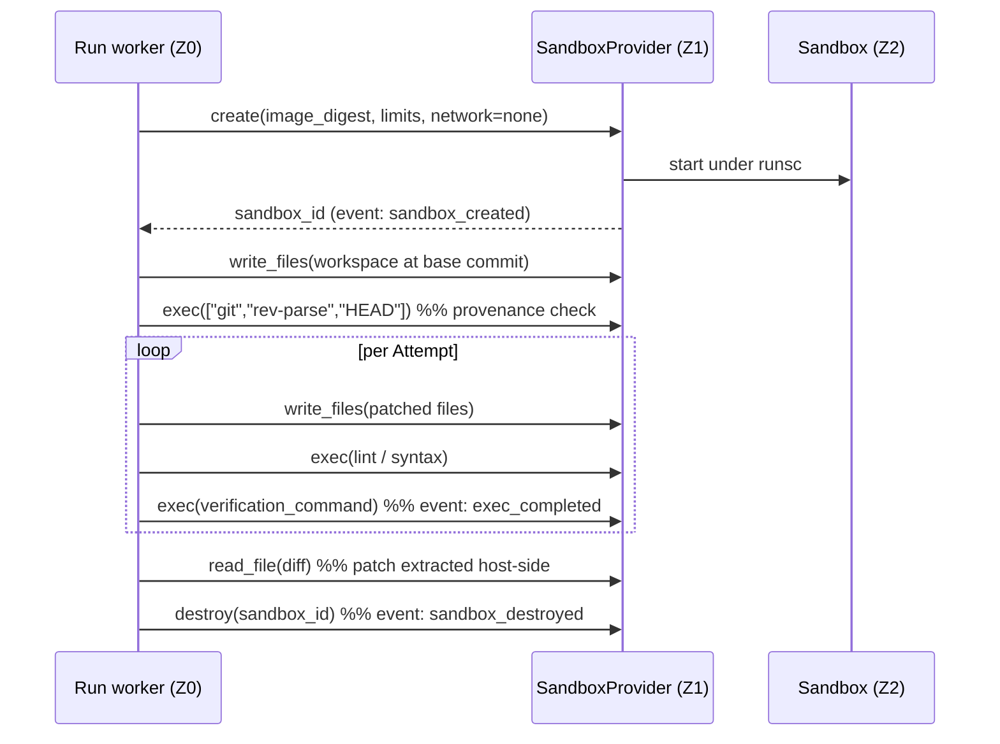

# Execution isolation

The mechanism for [UF-1](01-system-overview.md#the-five-unforgivable-failures) and half of
[UF-4](01-system-overview.md#the-five-unforgivable-failures). Read this before touching anything
under `made/sandbox/`.

Working assumption: **every byte produced inside a Sandbox is attacker-controlled.** Not "probably
fine because the model is aligned" — attacker-controlled. The model can be steered by a crafted issue
description, a poisoned dependency, a README in the target repository, or a customer who is
themselves the adversary. The design must hold when the agent is hostile, because from the host's
point of view there is no way to tell.

## The boundary

v1 executes all model-generated code under **gVisor (`runsc`)**, an OCI runtime that interposes a
user-space kernel between the workload and the host kernel
([ADR-0005](../03-adr/0005-gvisor-v1-firecracker-deferred.md)). Firecracker microVMs are the
intended v2 boundary and the provider interface exists so that swap is additive rather than a rewrite.

Being explicit about what this buys and what it does not, because overstating it is how a security
claim becomes a liability: a workload under `runsc` does not issue syscalls to the host kernel
directly, so the host's syscall surface is reduced to what the Sentry itself uses. A Sentry
vulnerability is still a host compromise. gVisor is a strong boundary, not a hardware one, and
[13-security-and-compliance.md](13-security-and-compliance.md) says so to customers in those words.
The compensating controls below exist because the boundary is strong rather than absolute.

**Fail closed.** If the configured isolation runtime is unavailable, misconfigured, or reports an
unexpected version, the system refuses to execute
([FR-055](../01-product/03-functional-requirements.md)). There is no fallback to the default runtime.
This is the single most important line of code in the sandbox module: a silent downgrade to a
shared-kernel container would mean the product's central claim is false while every test still passes.

## Trust zones

| Zone | Contents | Secrets | Model access | Network |
| --- | --- | --- | --- | --- |
| Z0 control plane | API, worker, Postgres, object store, git mirrors | Yes | Yes | Yes |
| Z1 host sandbox runtime | `runsc`, image store, reaper | No | No | Host-level only |
| Z2 sandbox | Workspace, dependencies, test runners, model-generated code | **Never** | **No** | **None during verification** |

Rules, enforced in code and asserted by tests rather than documented as guidance:

- Nothing in Z2 receives a credential of any kind ([NFR-005](../01-product/04-non-functional-requirements.md)).
- Nothing in Z2 initiates a connection to Z0. All communication is Z0 → Z2 through the provider.
- No host path is bind-mounted into Z2 ([NFR-003](../01-product/04-non-functional-requirements.md)).
- One Sandbox serves one Run and is destroyed. Never reused, never shared, never resumed into a
  different Run.

## Layered controls

**L1 — Runtime.** `runsc` with a minimal, explicit argument set. The intake suggests configuring
`--net-raw` and `--allow-packet-socket-write` for Docker compatibility; v1 does **not** enable them,
because verification sandboxes run with no network at all and therefore need neither raw sockets nor
ARP. Adding a capability to satisfy a generic compatibility note, when the specific workload does not
use it, is how attack surface accumulates. If a future workload needs them, that is a superseding ADR.

**L2 — Network.** Verification runs with networking disabled entirely
([ADR-0006](../03-adr/0006-no-network-in-verification-sandbox.md),
[FR-057](../01-product/03-functional-requirements.md)). No interface but loopback, so there is no
allowlist to bypass, no DNS exfiltration channel, and no metadata endpoint to reach. This is a
stronger and *simpler* control than a proxy with an allowlist, and it is affordable only because
dependency installation was moved to image build time — the two decisions are one decision.

**L3 — Filesystem.** Read-only base image plus a per-Run writable layer for the workspace, mounted
`nosuid,nodev`. The workspace is populated through the provider, not mounted. On destroy the writable
layer is discarded. Paths supplied by an agent are resolved host-side against the workspace root
*after* symlink resolution before any read or write — a symlink planted by the agent pointing at
`/etc/shadow` is an expected attempt, not a hypothetical one.

**L4 — Resources.** cgroup v2 limits set explicitly at creation
([FR-058](../01-product/03-functional-requirements.md)). Defaults, which are Project-overridable
within a hard ceiling:

| Limit | Default | Reason |
| --- | --- | --- |
| vCPU | 2 | Enough for a test suite; bounds a mining payload |
| Memory | 4 GiB, OOM-kill | Node and JVM toolchains are memory-hungry; the cap must kill the guest, not the host |
| PIDs | 512 | Fork-bomb ceiling |
| Writable layer | 8 GiB | Fills on dependencies, not on an attack |
| Per-exec timeout | 600 s | A hung test must not consume the Run's TTL |
| Idle timeout | 90 s with no provider call | Reclaims Sandboxes leaked by a dead worker |

**L5 — Interface.** The Sandbox exposes exactly the operations below. No interactive shell, no port
forwarding, no arbitrary upload path. Each addition is attack surface and a v2 migration obstacle.

```
create(image_digest, limits, network=none) -> SandboxId
write_files(sandbox, files)        # host-validated paths only
read_file(sandbox, path, range)    # host-validated, symlink-resolved
exec(sandbox, argv, cwd, timeout_s, env)   # argv list, never a shell string
destroy(sandbox)
```

`exec` takes an argument vector, never a command string. A string interface invites shell
interpolation, and the first time a filename contains a quote the system executes something nobody
wrote.

**L6 — Host posture.** Sandbox execution runs on a host carrying no control-plane secret beyond what
the worker needs, with unattended security updates, a patched kernel, and a documented patch SLO for
runtime advisories ([NFR-004](../01-product/04-non-functional-requirements.md)). In v1 the control
plane and the sandbox runtime share a host, which is a known compromise recorded in
[ADR-0005](../03-adr/0005-gvisor-v1-firecracker-deferred.md); the compensating control is that the
worker holds credentials in memory only and the Sandbox has no route to it.

## Sandbox lifecycle



Two details that are easy to get wrong and that reviewers must check. The workspace is populated by
`write_files` from the control plane's git mirror rather than by cloning inside the Sandbox, because
cloning requires network and a credential — the two things Z2 must not have. And the patch is
extracted by reading the workspace host-side; the Sandbox never pushes anything anywhere, which means
delivery remains a control-plane action gated on human approval
([FR-032](../01-product/03-functional-requirements.md)).

## Dependencies and images

Dependency installation happens at **image build time**, performed by the operator, outside any Run
([FR-061](../01-product/03-functional-requirements.md)). The image is pinned by digest on the Project
([FR-008](../01-product/03-functional-requirements.md)) and the digest is recorded on every Run
([FR-060](../01-product/03-functional-requirements.md)), so an audit can answer "what was installed"
by inspecting one immutable artifact rather than reconstructing a network trace.

The cost of this decision is real and must be stated: an agent cannot add a dependency as part of a
task. A change that needs a new package fails verification, escalates to a human, and the operator
rebuilds the image. That is a workflow limitation accepted deliberately — it removes remote package
installation, the largest supply-chain surface in agentic coding, from the runtime entirely, and it
also removes the largest component of Sandbox wall-clock time
([00-context/04-business-model.md](../00-context/04-business-model.md)).

**v1 does not build or run model-authored container images.** Tasks of kind `iac` produce Dockerfiles,
Compose files and pipeline definitions that are verified by static validators — a Dockerfile linter, a
Compose config parse, an IaC validator. Building an image the model wrote would require a builder with
network access and would then execute its `RUN` steps, which is a materially different threat model.
It is a v2 item in [15-future-phase-seams.md](15-future-phase-seams.md).

## What an escape would look like, and what stops it

| Attack | Mechanism relied on | Residual risk |
| --- | --- | --- |
| Kernel exploit from guest | `runsc` Sentry intercepts syscalls; host kernel surface reduced | A Sentry vulnerability is a host compromise. Patch SLO [NFR-004](../01-product/04-non-functional-requirements.md); Firecracker in v2 |
| Steal a credential | No credential exists in Z2 | An operator misconfiguring an env var into the image — caught by `tests/escape/test_no_credentials.py` |
| Exfiltrate source | No network during verification | Source reaches configured model endpoints by design; that is the operator's choice, recorded and configurable to local-only |
| Reach cloud metadata | No network; also no route at host level | None while network is disabled; returns as a risk if a future workload needs egress |
| Persist across Runs | Writable layer discarded, one Sandbox per Run | Image tampering, mitigated by digest pinning |
| Escape through a file path | Host-side symlink-resolved path validation | Validation bug — hence the traversal cases in the escape suite |
| Exhaust the host | cgroup CPU, memory, PID and disk caps, plus timeouts | Host-level disk pressure from many concurrent Runs; bounded by the concurrency cap |
| Attack the control plane | No Z2 → Z0 route; provider is one-way | A vulnerability in the provider's response parsing — treat provider output as untrusted input |

## Escape test suite

The isolation claim is only as good as the suite that proves it. `tests/escape/` runs against the
**real** runtime and image, is release-blocking
([NFR-002](../01-product/04-non-functional-requirements.md)), and gains a permanent case for every
incident. Required cases:

| Case | Payload | Expected |
| --- | --- | --- |
| Runtime identity | Inspect kernel identity inside the Sandbox | Confirms the isolation runtime is in use, not the default one |
| Fail closed | Configure a non-existent runtime | Run creation refuses; nothing executes |
| No network interfaces | Enumerate interfaces; attempt outbound TCP, UDP, DNS | Loopback only; every attempt fails; egress events recorded |
| Metadata endpoint | Connect to link-local metadata addresses | No route |
| Control-plane reach | Connect to the API and Postgres ports on the host | No route |
| Host filesystem | Enumerate `/proc/1/root`, `/dev/kvm`, look for bind mounts | Absent or inaccessible |
| Privilege escalation | SUID hunt, `unshare`, `mount`, module load | Denied |
| Fork bomb | Recursive fork | PID cap; host unaffected |
| Memory bomb | Allocate past the cap | Guest OOM-kill only |
| Disk fill | Write past the layer quota | Quota error; host disk unaffected |
| CPU spin | Long-running busy loop | CPU cap honoured; per-exec timeout kills it |
| Path traversal | Symlink inside the workspace to a host path, then `read_file` | Rejected by host-side validation |
| Credential sweep | `env`, `~/.aws`, `~/.netrc`, `~/.git-credentials`, `git remote -v` | Nothing found; no token embedded in the remote |
| Persistence | Write a cron entry and a systemd unit, destroy, re-create | Fresh Sandbox has no trace |
| Cross-Run residue | Run A writes a marker, destroy; Run B searches for it | Not found |
| Argv injection | Filename containing shell metacharacters passed to `exec` | Executed literally; no shell interpretation |

## v2 seam

`SandboxProvider` is the only module that may know which runtime is in use. Nothing above it may
reference `runsc`, Docker, containers or VMs — the glossary bans those words in identifiers for this
reason ([00-context/03-glossary.md](../00-context/03-glossary.md#banned-synonyms)). Swapping to
Firecracker means implementing the same six operations and passing the same escape suite unchanged.
If a change to the interface is required to accommodate a future runtime, that is a signal the
interface leaked and needs an ADR, not a quiet widening.
