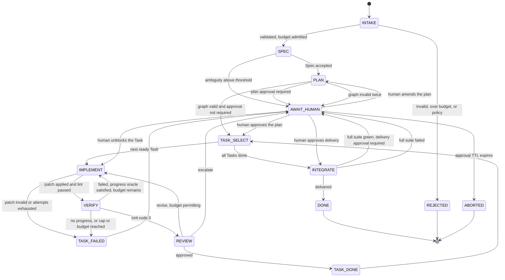

# Orchestration and termination

The mechanism for [UF-2](01-system-overview.md#the-five-unforgivable-failures). The normative state
machine is [`/contracts/state-machine.json`](../../contracts/state-machine.json); this document
explains it and specifies the guards.

The governing rule:

> **Agents produce artifacts. The system decides transitions. No agent has routing authority.**

Everything else here follows from that sentence. It is the difference between a system whose
termination is a property and one whose termination is a hope.

## Why a framework at all, and where its authority stops

LangGraph executes the graph, persists checkpoints and provides the interrupt primitive that makes a
durable human gate cheap ([ADR-0002](../03-adr/0002-langgraph-as-executor-with-pure-routing.md)). It
does not decide anything. Every conditional edge in the compiled graph calls a function in
`made/orchestrator/routing.py` with this shape:

```python
def route_after_verify(state: RunState) -> Literal["implement", "review", "task_failed", "await_human"]:
    """Pure. No IO, no clock, no randomness, no model call."""
```

Purity is a hard requirement, not a style choice, and it is enforced by review plus a static check
([04-engineering/03-coding-standards.md](../04-engineering/03-coding-standards.md)). Three properties
depend on it: the routing table is exhaustively unit-testable without a database or a model; a
historical event log can be replayed through current routing code to prove a fix
([09-audit-and-replay.md](09-audit-and-replay.md)); and migrating off LangGraph later means
re-hosting pure functions rather than reverse-engineering behaviour.

A router that reads the clock is the specific bug to watch for. TTL expiry is not evaluated inside a
router — it is delivered as an event by the driver, and the router reacts to the event. A router that
calls `datetime.now()` produces a different decision on replay than it did in production, which
silently destroys [NFR-016](../01-product/04-non-functional-requirements.md).

## States



`AWAIT_HUMAN` carries a `reason` and a `resume_to` State rather than being split into several waiting
states. One durable waiting state with structured metadata keeps the graph small enough to reason
about, and the reason code is what the viewer and the approval API branch on. Valid reasons:
`plan_approval`, `delivery_approval`, `ambiguous_request`, `task_failed`, `budget_exhausted`,
`cycle_detected`, `integration_failed`, `provider_unavailable`, `delivery_failed`, `policy_violation`.

## Transition table

The contract is authoritative; this is the readable form. The **Tool authority** column is not
documentation — it is the input to the toolbelt factory
([FR-069](../01-product/03-functional-requirements.md)), which is why prompt injection cannot widen
what a State can do ([06-verification-and-truthfulness.md](06-verification-and-truthfulness.md)).

| State | Actor | Tool authority | Success guard | Failure route |
| --- | --- | --- | --- | --- |
| `INTAKE` | system | none | Request valid, base ref resolvable, budget admitted, target branch is not default | `REJECTED` |
| `SPEC` | Architect | `read_range`, `grep`, `list_dir`, `symbol_def`, `references` | `Spec` validates; ambiguity below threshold | `AWAIT_HUMAN(ambiguous_request)` |
| `PLAN` | Architect | same read-only set | `GUARD_PLAN_VALID` passes | retry once, then `AWAIT_HUMAN` |
| `TASK_SELECT` | system | none | A ready Task exists | `INTEGRATE` when the graph is exhausted |
| `IMPLEMENT` | Developer / QA / DevOps by `task.kind` | read-only set plus `apply_patch` | `GUARD_PATCH_POLICY` passes, patch applies, lint passes | `TASK_FAILED` |
| `VERIFY` | system, **no model** | `run_verification` only | Exit code 0 | `IMPLEMENT` if `GUARD_PROGRESS` and `GUARD_BUDGET` allow, else `TASK_FAILED` |
| `REVIEW` | Reviewer | read-only set plus diff | Verdict `approve` | `IMPLEMENT` on `revise`, `AWAIT_HUMAN` on `escalate` |
| `TASK_DONE` | system | none | — | — |
| `TASK_FAILED` | system | none | — | always `AWAIT_HUMAN(task_failed)` |
| `INTEGRATE` | system | `run_verification` (full suite), git via broker | Full suite exit 0 and delivery approved | `AWAIT_HUMAN(integration_failed)` |
| `AWAIT_HUMAN` | human | none | A recorded approval | `ABORTED` on TTL |

Two transitions apply from **every** non-terminal State and are recorded in the contract as global
rather than drawn on the diagram, which would otherwise be unreadable: operator cancellation
([FR-016](../01-product/03-functional-requirements.md)) and wall-clock TTL expiry
([FR-018](../01-product/03-functional-requirements.md),
[NFR-011](../01-product/04-non-functional-requirements.md)), both terminating in `ABORTED`. TTL expiry is
delivered by the driver as an event; it is never evaluated inside a routing predicate, for the reason
given above.

Two absences carry weight. `VERIFY` has no model and cannot write, so no amount of persuasion in
repository content can make it report a pass. And no State's failure route is itself: there is no
self-loop anywhere in the graph, which is the structural reason an unbounded loop cannot exist even
before the guards are considered.

## Guards

Six deterministic predicates. They are layered because any single one can be defeated by an unlucky
model, and the requirement is that no single failure produces an unbounded run.

### GUARD_PLAN_VALID
Rejects a `TaskGraph` that contains a cycle, exceeds the Project's Task ceiling, or contains any Task
with an empty `verification_command`
([FR-024](../01-product/03-functional-requirements.md), [FR-025](../01-product/03-functional-requirements.md)).
This is the earliest and cheapest enforcement of [UF-3](01-system-overview.md#the-five-unforgivable-failures):
work that cannot be checked never enters the queue.

### GUARD_ATTEMPT_CAP
Per-Task cap (default 3) and per-Run total cap (default 12), counted from the `attempts` table rather
than from memory so that a restart cannot reset them
([NFR-010](../01-product/04-non-functional-requirements.md)).

### GUARD_PROGRESS
The one that matters most, because caps alone permit three identical expensive failures. A retry is
legal only if the system learned something:

```python
@dataclass(frozen=True)
class Progress:
    patch_hash: str          # sha256 of the applied patch
    compiles: bool           # syntax and lint result
    failing_count: int       # number of failing checks
    failure_signature: str   # sha256 of normalised failure output

def may_retry(history: list[Progress], now: Progress) -> bool:
    if any(p.patch_hash == now.patch_hash for p in history):
        return False                                   # identical patch: pure thrash
    prev = history[-1]
    if now.failure_signature == prev.failure_signature and now.failing_count >= prev.failing_count:
        return False                                   # same failure, no fewer failures: no information
    return True
```

Normalisation before hashing is what makes this work. Raw verification output differs on every run —
temporary paths, durations, object addresses — so an un-normalised signature makes every attempt look
novel and the guard becomes decorative. The normaliser is specified in
[06-verification-and-truthfulness.md](06-verification-and-truthfulness.md) and shared with the
context reducer in [08-context-and-retrieval.md](08-context-and-retrieval.md); it must have exactly
one implementation.

### GUARD_CYCLE
On entering any State, hash `(state, task_id, workspace_tree_hash, sorted input artifact digests)`. A
repeat means the system is provably redoing identical work, and it routes to
`AWAIT_HUMAN(cycle_detected)` ([FR-041](../01-product/03-functional-requirements.md)). This catches
loops that span states, which per-State attempt caps cannot see.

### GUARD_BUDGET
Pre-flight admission against Task, Run and deployment ceilings, using a tokeniser-measured estimate of
the assembled prompt plus the maximum output tokens. Specified in
[07-cost-control.md](07-cost-control.md). Denial is a transition, never an exception.

### GUARD_PATCH_POLICY
Rejects patches touching paths outside the workspace after symlink resolution, exceeding the size cap,
or modifying CI configuration, git hooks or submodule pointers
([FR-036](../01-product/03-functional-requirements.md)). The CI-configuration rule is worth its own
sentence: without it, an agent can grant itself arbitrary execution on the customer's runners, which
is the most direct privilege escalation available in this design.

## Graph state

The object LangGraph carries between nodes. It holds **references**, not content — the deliberate
opposite of the intake's proposed shape, for the reasons in
[ADR-0007](../03-adr/0007-git-worktree-as-project-state.md).

| Field | Type | Reducer | Note |
| --- | --- | --- | --- |
| `run_id`, `project_id`, `config_version` | str | replace (write-once) | Set at `INTAKE` |
| `state` | str | replace | Mirrors the contract enum |
| `base_commit`, `branch`, `head_commit` | str | replace | Git is the workspace state |
| `spec_ref`, `task_graph_ref` | artifact digest | replace | Never inline content |
| `tasks` | list of Task | replace whole list | Written once at plan acceptance; a reducer that merges Tasks would let a later node invent one |
| `current_task_id` | str or null | replace | |
| `attempts` | list of AttemptRecord | append | The only append-reduced field; ordering is by `attempt_no`, not arrival |
| `spent_usd` | Decimal | replace from ledger | Derived from `llm_calls`, never incremented in the state object, so the state cannot disagree with the ledger |
| `await_reason`, `resume_to` | str or null | replace | |
| `guard_trips` | list | append | Diagnostic trail |

Two rules about reducers, because this is where a fan-out feature would break the system. Only
`attempts` and `guard_trips` are append-reduced; everything else is replace. And because v1 executes
Tasks sequentially ([FR-027](../01-product/03-functional-requirements.md)), no two nodes write the
same field concurrently — the append reducers are for ordering across sequential Attempts, not for
merging parallel writers. Introducing parallel Tasks means revisiting every reducer, which is why
parallelism is a seam ([15-future-phase-seams.md](15-future-phase-seams.md)) rather than a
configuration flag.

**Not in graph state:** file contents, raw model transcripts, secrets, the full event log, tool
outputs beyond the current Attempt's compacted record. Checkpoints are written on every super-step;
anything in state is written repeatedly and, in practice, ends up in a prompt.

## Human gates

`AWAIT_HUMAN` uses the framework's interrupt so that a waiting Run holds no process and no Sandbox.
The Sandbox is destroyed on entering the state and recreated on resume — waiting is cheap, and a
Sandbox held open for an hour while someone is at lunch is both a cost and an exposure.

Gates in v1: after `PLAN` when the Project enables plan approval; before delivery, always
([FR-032](../01-product/03-functional-requirements.md)); and on every escalation path. Approvals are
recorded with the actor and the artifact digests shown to that actor, so "who approved what" is
answerable from the audit log rather than from memory.

Approval requests carry a TTL. An unanswered gate terminates in `ABORTED` rather than waiting forever,
because an indefinitely parked Run is a resource leak and a false impression of work in progress.

## Failure taxonomy

Naming these prevents a common mistake: handling a model failure as if it were an infrastructure
failure, and thereby retrying something that will never succeed.

| Class | Example | Handling |
| --- | --- | --- |
| Deterministic rejection | Patch does not apply; plan has no oracle | Counts as an Attempt; feedback to the agent; guards apply |
| Verification failure | Tests fail | Counts as an Attempt; the progress oracle decides whether another is permitted |
| Schema failure | Model returns malformed JSON | One repair retry, then the State fails ([FR-052](../01-product/03-functional-requirements.md)); does not consume a Task Attempt |
| Transient infrastructure | Provider 503, Sandbox create failure | Bounded retry with backoff at the effect level; does not consume an Attempt; escalates to `AWAIT_HUMAN` after the bound |
| Guard trip | Cap, cycle, budget | Immediate route to `AWAIT_HUMAN`; never retried |
| Policy violation | Patch touches CI config | Attempt fails and the Run escalates immediately; not retried, because a repeat is a signal, not noise |

## What this design deliberately does not do

**No dynamic agent spawning.** LangGraph's `Send` allows instantiating an unknown number of workers at
run time, and the intake names it as a target capability. v1 forbids it: an unknown number of agents
is an unknown budget, and the whole point of the guards is that the bound is known before the spend
happens.

**No agent-to-agent messaging.** There is no channel for the Developer to ask the Architect a
question. Information moves as artifacts through the orchestrator. A direct channel would be
unbounded in both tokens and turns, and unauditable.

**No self-modifying graph.** The graph topology is compiled from code, not produced by a model. A
model that can add a node can add a loop.

**No "just one more attempt" affordance.** There is no operator override that raises a cap mid-Run.
Raising the cap means editing the Project configuration, which is versioned and recorded, and then
starting a new Run. An override would appear in the audit log as an unexplainable extra attempt.
