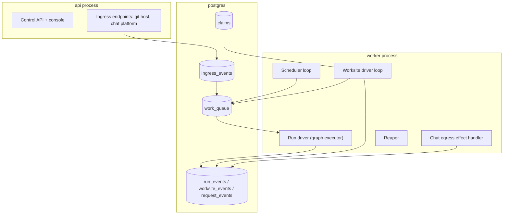

# Persistence and concurrency

The previous architecture was request-oriented: one request, one Run, one execution, done. Nothing in
it waited for anything, and nothing happened unless somebody asked. The new vision has agents that
*live* in the environment, reacting to events and running several worksites at once
([ADR-0026](../03-adr/0026-resident-agents-event-ingestion-visible-queues.md)).

That is a genuine architectural change, and the first thing to be clear about is what it is **not**.

> **Residency is a property of the control plane, not of the agents.** No agent process outlives a Run.
> No agent holds context between Runs. Nothing an agent concluded reaches later work except as a named
> artifact with a digest ([FR-115](../01-product/03-functional-requirements.md),
> [FR-121](../01-product/03-functional-requirements.md)). The swarm is delivered by durable ingestion,
> durable schedules and visible queues.

The reason is not architectural taste. An agent whose behaviour depends on state that is in no event
log makes "why did it do that" unanswerable, which breaks
[UF-5](01-system-overview.md#the-five-unforgivable-failures) and is what Seam 7 forbids
([15-future-phase-seams.md](15-future-phase-seams.md)). A process that decides for itself when to act
has no admission-control point, which breaks
[UF-2](01-system-overview.md#the-five-unforgivable-failures). The trade is real and is recorded: the
familiarity a context-carrying agent might build is not available under this decision.

## What this adds, inside the existing process kinds

Nothing here is a new process kind ([FR-120](../01-product/03-functional-requirements.md),
[NFR-021](../01-product/04-non-functional-requirements.md)).

| Component | Lives in | Job |
| --- | --- | --- |
| **Ingress endpoints** | `api` | Accept an inbound trigger, record it, return. No work is done on the request path |
| **Ingress event log** | `postgres` | Every trigger, recorded before anything acts on it, idempotent on the provider's delivery identifier |
| **Work queue** | `postgres` | Durable, bounded, visible. Claimed with `SELECT … FOR UPDATE SKIP LOCKED` |
| **Scheduler loop** | `worker` | Fires declared schedules; records skips |
| **Worksite driver loop** | `worker` | Advances worksite cycles: survey, slice, enqueue, evaluate the campaign progress oracle |
| **Claim registry** | `postgres` | Exclusive path-scope claims per repository per worksite |
| **Chat egress handler** | `worker` | Posts allowlisted messages, records each as an egress decision |

## Ingestion

**Record first, act second** ([FR-116](../01-product/03-functional-requirements.md)). Every inbound
trigger becomes an `ingress_event` row before any work is created:

| Source | Trigger |
| --- | --- |
| Git host | Pull request opened or updated; push to a default branch; check-suite completed |
| Chat platform | A message addressed to the system in a thread |
| Scheduler | A declared window arriving |
| Worksite driver | A cycle becoming due |
| Console or API | A person creating a Run, a worksite, or an approval |

Three rules, and each closes a failure the request-oriented design never had.

**Idempotent on the provider's delivery identifier.** A redelivery — which every git host and chat
platform does, sometimes in bursts — produces no second Run
([NFR-033](../01-product/04-non-functional-requirements.md)). The delivery identifier is a unique
constraint, so the second insert fails rather than being deduplicated by application logic.

**An ingress event that cannot be recorded is not acted on.** The same rule as every other effect
([09-audit-and-replay.md](09-audit-and-replay.md)): if it cannot be logged, it does not happen. Postgres
being unavailable means triggers are rejected at the endpoint, visibly, rather than accepted and lost.

**Recording is not accepting.** An ingress event is recorded even when it will produce nothing —
an unmapped chat identity, a repository with no advisory class enabled, a push to a repository whose
worksites are all paused. "We saw it and did nothing, for this reason" is the answer to the most common
support question about a reactive system, and it is only answerable if the event exists.

### Polling as a configured alternative

A self-hosted deployment behind a firewall may be unable to accept inbound connections. It polls
instead, with the latency consequence stated rather than hidden
([ADR-0026](../03-adr/0026-resident-agents-event-ingestion-visible-queues.md)). Polling produces the
same `ingress_event` rows with the same idempotency key, so nothing downstream knows which mechanism
was used — that is the seam being kept clean.

## Queues, and the rule that was reversed

[03-api-design.md](03-api-design.md) refuses to queue: exceeding the concurrency limit returns `429`
"because an invisible queue makes cost and latency unpredictable and violates the honest-failure
principle. The client decides whether to wait."

That is correct for a human calling an API and unworkable for a system reacting to events, because
there is no client to decide. A pull request opened while the deployment is at capacity would simply
never be reviewed, silently — which is a *worse* violation of the same principle than queueing.

So the rule is reversed and its **purpose is preserved by a different mechanism**
([FR-117](../01-product/03-functional-requirements.md)):

- **Human-submitted API requests still get `429`.** Unchanged. A caller can decide.
- **Internally generated work queues**, and every queued item is a durable row carrying its
  **position**, its **age**, the **reason** it is waiting and its **cause** — the cap, the claim, the
  ceiling or the dependency responsible.
- **Every queue is bounded.** Reaching a bound sheds work with a recorded reason. A queue that grows
  without limit is an invisible queue with extra steps.
- **The queue is a page in the console** and a metric
  ([09-web-interface-and-admin-console.md](../01-product/09-web-interface-and-admin-console.md)).

The test of whether this preserved the principle is a question the operator must be able to answer from
the interface: *"why has nothing happened for two hours."* Under the old design the answer was a `429`
the caller saw. Under this one it is a queue row with a reason. Under a naive queue it would be nothing
at all.

## Scheduling

Schedules and worksite cycles are rows and survive restarts
([FR-118](../01-product/03-functional-requirements.md)). Two rules:

**A missed window is a recorded skip with a reason, never a backfill.** A deployment down for six hours
does not wake up and fire six windows. Backfilling is how a schedule becomes a spend spike at exactly
the moment nobody is watching.

**No clock read enters a routing predicate.** This is the existing purity rule
([ADR-0002](../03-adr/0002-langgraph-as-executor-with-pure-routing.md)) and the vision change made it
harder to honour, because schedules, TTLs, queue ages and worksite cycles are all time-bearing. The
discipline is unchanged: the driver evaluates time and *delivers an event*; predicates react to the
event. A guard that computes "is this window due" is a guard that decides differently on replay.

## Concurrency and resource governance

Four levels, all checked before a Run is created
([FR-119](../01-product/03-functional-requirements.md)):

| Level | Bounds | Why it exists |
| --- | --- | --- |
| Deployment | Total concurrent Runs and daily spend | Host capacity, and our bill in a hosted deployment |
| Tenant | Concurrent Runs and spend | One tenant MUST NOT exhaust another's capacity ([ADR-0021](../03-adr/0021-deployment-agnostic-core-hosted-and-self-hosted.md)) |
| Project | Concurrent Runs and spend | The pre-existing boundary; unchanged |
| Worksite | Concurrent Runs, total Runs, total spend, open pull requests | A campaign is the loop above every per-Run bound ([07-worksites.md](../01-product/07-worksites.md)) |

Admission is checked at **every** level, cheapest first, before the Run row exists. Checking after
creation would mean a Run that exists and cannot proceed, which is the invisible queue again.

**Fairness between tenants is the honest weak point.** `SKIP LOCKED` gives no fairness guarantee: a
tenant with a hundred queued slices and a tenant with one are indistinguishable to it, so the first can
starve the second within the deployment cap. The per-tenant concurrency cap bounds the damage and does
not eliminate it. [ADR-0026](../03-adr/0026-resident-agents-event-ingestion-visible-queues.md) names
this as the thing a Postgres queue table does worst, and it is the measured trigger for reopening the
broker decision. It is stated here rather than left to be discovered.

## Two worksites, one repository

Worksites hold **exclusive claims** on a path scope per repository
([FR-100](../01-product/03-functional-requirements.md)). A claim is a row; overlap is a prefix
comparison; the second claimant waits with a recorded reason.

What happens to the files themselves, in order of when it is caught:

1. **Claim conflict, at worksite activation.** Overlapping scopes: the second worksite waits. Caught
   before anything executes, which is where a conflict is cheapest.
2. **Stale base, at slice planning.** A slice whose base is no longer the default-branch head is
   re-planned rather than delivered ([FR-105](../01-product/03-functional-requirements.md)).
3. **Patch does not apply, at implementation.** The search/replace format rejects a non-exact match
   with a structured error rather than fuzzy-matching it
   ([ADR-0008](../03-adr/0008-search-replace-patch-format.md)). This is the mechanism that makes a
   concurrent edit a *rejection* rather than a corruption, and it was already there.
4. **Verification fails, at `VERIFY`.** The last line of defence and the one that actually holds: two
   independently correct changes that conflict semantically produce a failing suite, and the Attempt
   fails honestly.

Note what is **not** built: no merge-conflict resolution, no rebase-and-retry loop, no three-way merge.
A slice that cannot be delivered cleanly escalates. Automatic conflict resolution is where a system
starts producing changes nobody authored, and Seam 3 refuses it for the same reason
([15-future-phase-seams.md](15-future-phase-seams.md)).

And unchanged: **Tasks inside one Run still execute one at a time**
([FR-027](../01-product/03-functional-requirements.md)). Concurrency exists between Runs and between
worksites, never inside a Run.

## What survives between Runs

Exactly three places ([FR-121](../01-product/03-functional-requirements.md)):

| Where | Holds | Read by |
| --- | --- | --- |
| The **git repository** | The code, the branches, the delivered pull requests | Everything. It is the workspace state ([ADR-0007](../03-adr/0007-git-worktree-as-project-state.md)) |
| The **event logs** — Run, worksite, request | What happened, foldable to state | Audit, replay, the console, the effectiveness dashboard |
| **Versioned configuration rows** | Projects, work classes, worksites, schedules, entitlements, approval policy, budgets | Admission, routing inputs, the console |

There is no fourth. No cache of conclusions, no vector index, no semantic memory, no "things that
worked last time" table. A worksite surviving three weeks and forty cycles does so on rows and an event
log, which is precisely what allowed worksites to be added without reopening Seam 7.

The **framework checkpoint** remains what it always was: a resumption cache, never an audit source, and
never read on an audit, export or reporting path
([ADR-0004](../03-adr/0004-event-log-separate-from-checkpoints.md)).

## Failure modes this adds

| Failure | Detection | Response | Degraded mode |
| --- | --- | --- | --- |
| Ingestion stops | No ingress events while the deployment is up | Alert — this needs one of the eight slots ([NFR-022](../01-product/04-non-functional-requirements.md)) | **The quietest failure in the system**: nothing breaks, work simply does not happen. There is no user-visible error, which is why it is alerted rather than given an availability target |
| Redelivery storm | Ingress insert conflicts spike | Idempotency key rejects duplicates; the rate is a metric | No second Run is created. Cost is bounded because nothing was enqueued |
| Queue at its bound | Queue depth metric | Shed with a recorded reason | Work is refused visibly, per item, with a cause |
| One tenant starves another | Per-tenant queue wait at p95 | Per-tenant concurrency cap bounds it | Bounded, **not eliminated** — the honest weak point above |
| Schedule window missed | Skip event recorded | None; it is a fact | No backfill burst |
| Claim held by a stalled worksite | Claim age metric | The blocking worksite's own ceilings and progress oracle eventually pause it, releasing the claim | The blocked worksite waits visibly rather than proceeding |
| Chat platform unavailable | Post failure | Bounded retry, then record the egress decision as failed | The Run is unaffected. **A request is never reported as answered when the post failed** — the same rule as delivery ([14-integrations.md](14-integrations.md)) |

## What is deliberately not built

**No long-lived agent processes.** The reason is above and it is the largest thing this document
refuses.

**No message broker.** Postgres carries the queue. A broker cannot participate in the transaction that
writes an effect with its event, so adopting one would either weaken the audit guarantee or require a
two-phase reconciliation that is more work than the queue table
([ADR-0026](../03-adr/0026-resident-agents-event-ingestion-visible-queues.md)).

**No outbound webhooks to arbitrary customer URLs.** Chat egress is a specific, allowlisted, per-post
recorded path ([FR-114](../01-product/03-functional-requirements.md)). Seam 6's general prohibition
otherwise stands.

**No backfill, no catch-up, no replay of missed windows.**

**No automatic merge-conflict resolution.**

**No distributed coordination.** The lease mechanism permits a second worker
([11-infrastructure-and-devops.md](11-infrastructure-and-devops.md)); nothing is designed, sized or
tested for it, and tenant fairness is the part that would need real work.

**No priority queue.** Every queued item waits by position and cause. A priority field invites a
per-tenant priority, which is a fairness mechanism with none of the fairness — and the honest version
of "this tenant first" is a higher concurrency cap, which is visible in configuration.
