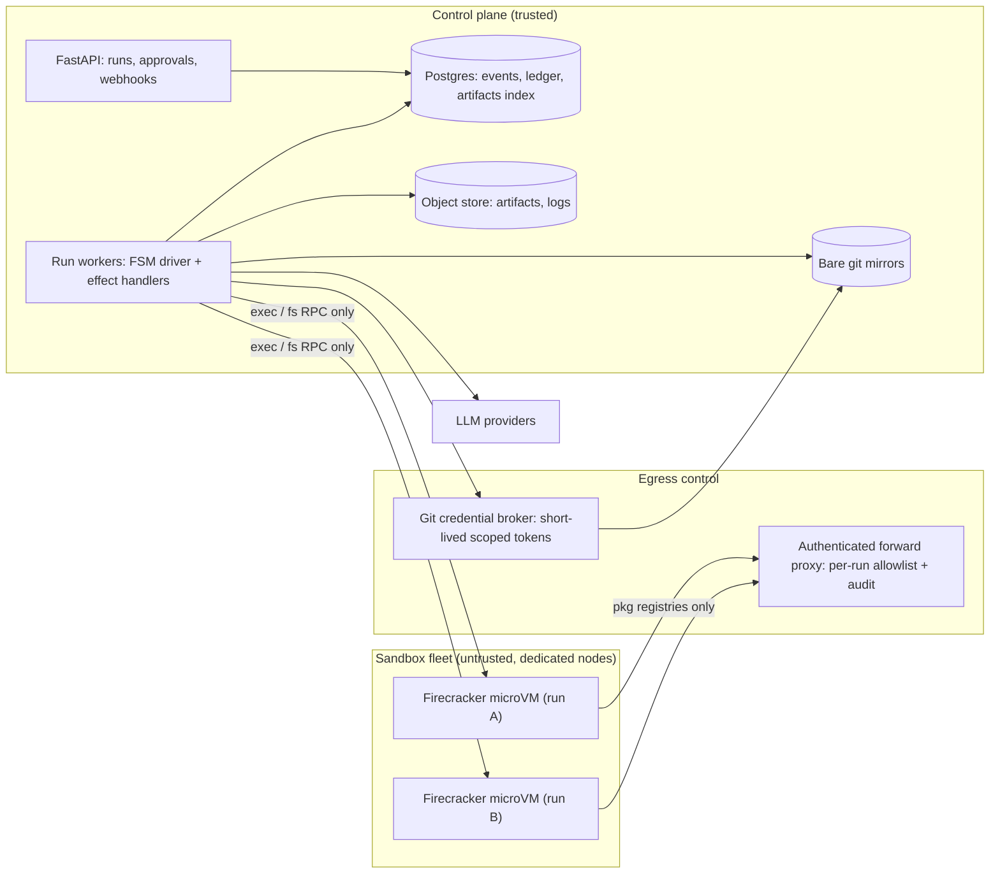

# 01 — Recommended Tech Stack

Selection criteria, in priority order, for a bootstrapped B2B MVP:

1. **Correctness of the isolation boundary** — a single host compromise is an existential event for a
   company selling "we run AI-generated code for you".
2. **Determinism and replayability** — required both for loop prevention and for the incident
   forensics your first enterprise buyer will ask about.
3. **Iteration velocity on prompts and control flow** — the product is 80% control flow and prompt
   engineering; the infrastructure should not tax that loop.
4. **Unit economics** — LLM tokens plus sandbox seconds are your COGS. The architecture must let you
   attack both without a rewrite.
5. **Minimum operable surface** — one team. Every additional daemon must justify its pager load.

---

## 1. Languages

| Component | Language | Rationale |
| --- | --- | --- |
| Control plane, orchestrator, agent layer, toolbelt | **Python 3.12** | Non-negotiable ecosystem: provider SDKs, `tree-sitter` bindings, `tiktoken`, `pydantic` for artifact schemas, eval tooling. Every published agentic-coding technique lands in Python first. |
| Guest agent inside the sandbox (`madeagent`) | **Go** (single static binary) | Must run in a minimal rootfs with no interpreter, start in milliseconds, and be small enough to audit line-by-line. This binary is a security boundary component; keep it dependency-free. Python here would drag in an interpreter and package surface for no benefit. Needed for Fly Machines and for self-hosted Firecracker; E2B ships its own guest runtime, so this is deferred if E2B is the PoC provider. |
| Dashboard / run viewer | **TypeScript + Next.js**, or server-rendered Jinja + HTMX for the PoC | Do not build a SPA before you have a design partner. A log/event viewer is enough through the PoC. |
| Infrastructure definition | **Terraform** + a single `Makefile` | No Helm, no Kustomize, no k8s in MVP. |

**Rejected: TypeScript for the agent plane.** Viable, and if the founding engineer is materially
faster in TS, that speed can outweigh the ecosystem gap. But: `tree-sitter` and tokeniser tooling is
second-class, the evaluation-harness ecosystem (SWE-bench-style) is Python, and prompt/patch
utilities land in Python months earlier. Choose TS only as a deliberate, documented trade.

**Rejected: Go or Rust for the agent plane.** Correct for the sandbox supervisor and guest agent,
wrong for prompt iteration. You will rewrite agent logic dozens of times in the first month; compile
cycles and verbose JSON handling tax exactly the loop that matters.

---

## 2. Orchestration runtime — the central decision

### 2.1 Requirements

- Transitions are decided by the **system**, never by the model.
- Runs are **durable and resumable**: a worker crash mid-`VERIFY` must not lose the run or double-spend tokens.
- Every step carries a **timeout, retry policy, and cost budget** that the framework enforces, not the prompt.
- Runs can **block on a human** for hours or days without holding a process open.
- Full history is **replayable** for debugging, regression testing and audit.

### 2.2 Options

| Option | Strengths | Disqualifying / costly weaknesses |
| --- | --- | --- |
| **CrewAI / AutoGen / MetaGPT** | Fast demo, roles out of the box | Termination is emergent from conversation, not asserted by the system. No first-class budget/attempt enforcement, no durable resumption, weak multi-tenant isolation. Directly violates constraint 2. **Reject.** |
| **LangGraph** | Explicit graph, Postgres checkpointer, `interrupt()` for human-in-the-loop, good velocity | Durability is in-process (worker death mid-node is your problem); checkpoint schema migration across shipped versions is painful; the abstraction stack tends to leak into prompt construction; debugging is framework-shaped rather than domain-shaped. Acceptable for a demo, uncomfortable as a load-bearing B2B dependency. |
| **Temporal** | Durable execution with deterministic replay, per-activity retries/timeouts, signals for human approval, durable timers, and an audit log as a by-product. Exactly the properties constraint 2 demands. | Real ops burden (self-hosted cluster or Temporal Cloud spend), determinism constraints in workflow code, and a learning curve that is unwelcome in week one. |
| **Hand-rolled FSM over Postgres + queue** | Total control, ~400 LOC, trivially testable, zero lock-in | You will re-implement retries, timers, idempotency and visibility — badly — if the product outgrows a single node. |

### 2.3 Recommendation: own the transition function, rent the durability

Write the core as a **pure function** with no IO:

```python
# made/orchestrator/transitions.py — no network, no clock, no randomness.
def decide(state: RunState, event: Event) -> Decision:
    """Returns the next state plus the effects to execute. Total, deterministic, unit-testable."""
```

All side effects (LLM calls, sandbox operations, git writes) are **effect handlers** invoked by a
driver, never called from `decide`. Then:

- **PoC (milestones P0–P3):** driver is an in-process runner; durability comes from the append-only
  `run_events` table — on restart, re-fold the events and continue. One dependency, one process.
- **Post-PoC (P5+, first concurrent tenants):** bind the *same* `decide` function to a Temporal
  workflow; effect handlers become activities and inherit retries, timeouts, heartbeats and signals.

This is a deliberate hedge. The expensive, product-specific asset (the transition table and its
guards) is yours and portable. The commodity, ops-heavy asset (durable execution) is rented at the
moment it starts to hurt. Writing `decide` under Temporal's determinism rules from day one — no
`datetime.now()`, no `random`, no IO — makes that migration mechanical rather than a rewrite.

**Revisit if:** you reach concurrent runs across tenants, or a run must survive a deploy, before P5.
Then pull Temporal forward; do not paper over it with a bigger in-process runner.

---

## 3. Execution sandbox

### 3.1 Options

| Option | Boundary | Boot | Verdict |
| --- | --- | --- | --- |
| Docker / OCI containers | Shared kernel, namespaces + cgroups | ~100 ms | **Rejected by requirement.** A kernel LPE is a host compromise; `runc` CVEs are recurrent. Container tooling is still used, but only *inside* the VM boundary. |
| **gVisor (`runsc`)** | Userspace kernel (Sentry) intercepting syscalls | ~200 ms | Strong and easy to deploy without KVM. But a Sentry escape is a host compromise, and syscall-heavy workloads (`npm install`, `pytest` collection) pay a measurable penalty. Compatibility gaps (io_uring, some FUSE/netlink paths) will surface in real builds. **Acceptable fallback, not the target.** |
| Kata Containers | VM per pod, KVM | ~0.5–1.5 s | Correct boundary, OCI/k8s-native. Heavier memory and boot overhead; pulls you toward Kubernetes earlier than an MVP wants. |
| **Firecracker microVM** | KVM hardware virtualisation, minimal device model, `jailer` + seccomp | ~125 ms cold, ~tens of ms from snapshot | **Target boundary.** Smallest audited attack surface per unit of isolation, best density, snapshot/restore enables cheap "warm workspace" resume. Requires `/dev/kvm` (bare metal, `*.metal` instances, or nested-virt-capable hosts) and a control plane you must build. |
| Managed Firecracker (E2B, Fly Machines, Modal, Daytona) | Vendor-operated microVMs | ~150 ms–1 s | **PoC choice.** Buys the VM control plane, images, networking and snapshots outright. Cost per sandbox-hour is 3–6× self-hosted, which is fine at zero customers and unacceptable at scale. |
| WASM / WASI (`wasmtime`) | Capability-based, no host syscalls | ~ms | Excellent isolation, but cannot run `pip`, native extensions, real test runners or arbitrary customer toolchains. **Reject** — it eliminates the product. |

### 3.2 Recommendation

**Firecracker microVMs are the isolation boundary. Do not build the Firecracker control plane during
the PoC.** Start on a managed Firecracker provider (E2B fits closest: filesystem + process API +
snapshots; Fly Machines if you want general-purpose VMs and to ship your own guest agent), behind a
deliberately narrow interface:

```python
class SandboxProvider(Protocol):
    async def create(self, image: ImageRef, limits: ResourceLimits, netpol: EgressPolicy) -> Sandbox: ...
    async def exec(self, sb: Sandbox, argv: list[str], *, cwd: str, timeout_s: int, env: dict[str, str]) -> ExecResult: ...
    async def write_files(self, sb: Sandbox, files: Iterable[FileWrite]) -> None: ...
    async def read_file(self, sb: Sandbox, path: str, byte_range: tuple[int, int] | None) -> bytes: ...
    async def snapshot(self, sb: Sandbox) -> SnapshotRef: ...
    async def destroy(self, sb: Sandbox) -> None: ...
```

Six methods. No streaming shells, no port forwarding, no volume mounts in v1 — every additional
capability is attack surface and a migration obstacle. When sandbox spend becomes a material share of
COGS, implement the same interface against self-hosted `firecracker-containerd` on bare metal
(Hetzner AX/EX-class hardware is roughly an order of magnitude cheaper per vCPU-hour than managed
microVM pricing) and cut over provider-by-provider with the escape test suite as the gate.

Full hardening requirements — credential brokering, egress policy, TTLs, host posture — are in
[02-secure-execution.md](02-secure-execution.md). The provider choice is only the first layer.

---

## 4. Datastores and supporting services

| Concern | Choice | Notes |
| --- | --- | --- |
| Control-plane state, event log, budget ledger | **Postgres 16** | Single source of truth. `run_events` append-only; run state is a fold. Advisory locks for single-writer-per-run. Add `pgvector` only if [04](04-context-and-cost.md) proves embeddings are needed — it is not in the critical path. |
| Work queue | **Postgres `SELECT … FOR UPDATE SKIP LOCKED`** | Do not add Redis/SQS for the MVP. Revisit at thousands of runs/day or when Temporal takes over queuing. |
| Artifacts, logs, patches, SBOMs | **S3-compatible object store** (Cloudflare R2 — zero egress fees) | Artifacts are content-addressed by sha256; Postgres stores only the digest + metadata. |
| Project workspaces | **Git**, one branch per run | The customer's remote (GitHub/GitLab) is the durable home; the control plane keeps a bare mirror. |
| Model providers | Two providers minimum behind one internal `LLMClient` | Provider outages are frequent enough to be an availability requirement, not a hedge. Route by capability tier ([04](04-context-and-cost.md)), pin model versions, record `(provider, model, version)` on every span. |
| Observability | **OpenTelemetry** traces → any OTLP backend; one span per FSM node and per LLM call, with token/USD attributes | Your event log is the audit trail; traces are the debugging tool. Do not conflate them. |
| Secrets | Cloud KMS/Secrets Manager, envelope encryption for per-tenant git tokens | Guest VMs never receive a secret. See [02](02-secure-execution.md). |
| CI | GitHub Actions; the **escape test suite** is a required check | An isolation regression must fail the build, not a review. |

---

## 5. Deployment topology



Three invariants in this diagram, and they are the whole security story:

1. **Only the control plane talks to the LLM providers.** The sandbox holds no API key, so
   instructions injected via repository content or dependency output cannot spend your credits or
   reach a model directly.
2. **The sandbox never holds a credential and never initiates a connection to the control plane.**
   Communication is control-plane → guest RPC, plus package-registry egress through an authenticated
   proxy. Git writes happen host-side via the broker.
3. **Sandbox nodes are dedicated hosts** carrying no control-plane secret. Compromise of a sandbox
   node must yield the attacker nothing beyond that run's workspace.

---

## 6. Cost posture (order-of-magnitude, to be replaced by measured numbers at P5)

| Line item | Driver | Primary lever |
| --- | --- | --- |
| LLM tokens | Input tokens dominate: repo map + task spec + attempt trail, re-sent per attempt | Prompt caching on a stable prefix; tiered model routing; diff-only edits; capped attempts |
| Sandbox seconds | Dependency installation and test runtime, not agent thinking | Snapshot a *warm* base image with dependencies pre-installed; a caching package proxy; aggressive idle TTL |
| Egress | Package downloads | Caching registry proxy; R2 for artifacts |

Instrument all three per run from P0 — a token/USD ledger added later is always wrong, and per-run
COGS is what determines whether this business has a price point.
