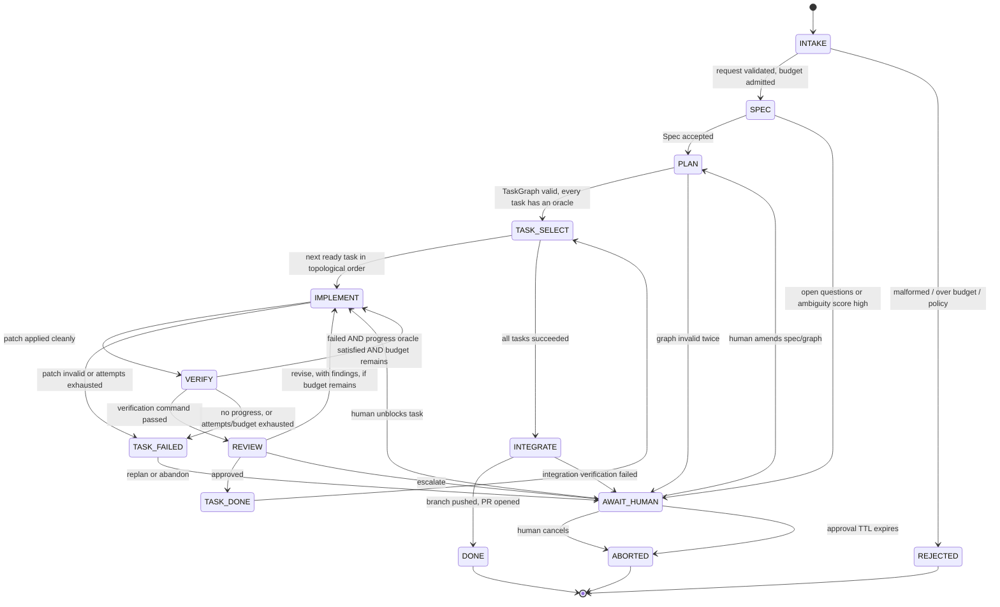

# 03 — State Management and Data Flow

This is the core of the product. Two claims drive the whole design:

> **1. Agents do not talk to each other. They read and write typed artifacts, and the orchestrator
> decides what happens next.**
>
> **2. The shared project state is a git repository, not a conversation.**

Multi-agent systems fail in production for a predictable reason: the control flow is emergent from
free-form dialogue, so termination is a hope rather than an invariant. Here, the model's output is
*data*; only the orchestrator has authority to route, retry, spend or stop.

---

## 1. Design principles

| Principle | Consequence |
| --- | --- |
| The graph is not the model's choice | Agents return a typed artifact plus a *proposed* verdict. `decide()` chooses the transition. A model can be wrong; it cannot be in charge. |
| Agents are stateless pure functions | `(role_prompt, input_artifacts, toolbelt) → output_artifact`. No hidden memory between states. Anything worth remembering is an artifact with an id. |
| Nothing is "done" without an executable oracle | Every task carries a machine-checkable `verification_command`. "The agent thinks it works" is not a transition condition. This single rule eliminates most infinite-loop behaviour. |
| State is an append-only event log | Run state is a fold over events. Replayable, auditable, debuggable, and a natural regression corpus. |
| Every effect is idempotent and keyed | Retries and crash recovery must never double-spend tokens or double-apply a patch. |
| Budgets are enforced at admission, not by the prompt | A step that cannot afford to run does not run. |

---

## 2. Domain model

```
Tenant ──< Project ──< Run ──< Task ──< Attempt ──< Effect(LLMCall | SandboxExec | GitWrite)
                        │        │
                        │        └──< Artifact (content-addressed, typed, immutable)
                        └──< RunEvent (append-only, ordered, the source of truth)
```

### Artifacts: the blackboard

Every inter-agent communication is an immutable, schema-validated, content-addressed artifact. Agents
never see each other's raw transcripts — they see the artifact.

| Artifact | Produced by | Key fields |
| --- | --- | --- |
| `FeatureRequest` | Human / API | prose, repo ref, base SHA, constraints |
| `Spec` | Architect | goal, non-goals, acceptance criteria, affected surfaces, open questions |
| `TaskGraph` | Architect | DAG of `Task`s with dependencies |
| `Task` | Architect | id, intent, target files (hint, not a constraint), **`verification_command`**, `budget_usd`, `max_attempts` |
| `Patch` | Developer | unified diff, touched paths, base SHA, rationale |
| `TestReport` | QA (executed in sandbox) | command, exit code, normalised failures, `failure_signature`, duration |
| `ReviewReport` | Reviewer | verdict (`approve`/`revise`/`escalate`), findings with file/line, severity |
| `AttemptRecord` | Orchestrator | what was tried, what failed, why — the compact substitute for a raw transcript |
| `RunSummary` | Orchestrator | commits, cost, timings, artifacts, outcome |

Schemas are Pydantic models with an explicit `schema_version`. Validation failure is a first-class,
retryable-once event — not an exception that kills a run. Artifacts are referenced in prompts **by id
plus a short digest**, and only fetched into context when the current state genuinely needs them.

---

## 3. The state machine



### Transition table (the authoritative artefact — the diagram is documentation)

| State | Agent | Tool authority | Success guard | Failure route |
| --- | --- | --- | --- | --- |
| `INTAKE` | none | none | schema valid, tenant budget available, repo reachable | `REJECTED` |
| `SPEC` | Architect | read-only: repo map, `read_range`, `grep` | `Spec` validates, ambiguity below threshold | `AWAIT_HUMAN` |
| `PLAN` | Architect | read-only | DAG acyclic, ≤ `MAX_TASKS`, **every task has a non-empty `verification_command`** | retry once → `AWAIT_HUMAN` |
| `TASK_SELECT` | none | none | a ready task exists | → `INTEGRATE` when the graph is exhausted |
| `IMPLEMENT` | Developer | read + `apply_patch` (workspace paths only) | patch applies, lint/compile passes | `TASK_FAILED` |
| `VERIFY` | QA | `exec(verification_command)` only — cannot write, cannot change the command | exit code 0 | `IMPLEMENT` if progress; else `TASK_FAILED` |
| `REVIEW` | Reviewer | read-only + diff | verdict `approve` | `IMPLEMENT` (`revise`) or `AWAIT_HUMAN` (`escalate`) |
| `INTEGRATE` | none | `exec` full suite; git via broker | full suite green, patch policy clean | `AWAIT_HUMAN` |
| `AWAIT_HUMAN` | none | none | human signal | `ABORTED` on TTL |

Tool authority being a column in this table — not a paragraph in a prompt — is what makes
[the injection defence](02-secure-execution.md#5-prompt-injection-is-an-authorisation-problem-not-a-prompt-problem)
real. `VERIFY` physically cannot write a file, whatever the model asks for.

---

## 4. Event sourcing

```sql
create table run_events (
  run_id        uuid        not null,
  seq           bigint      not null,          -- dense per run; the ordering authority
  ts            timestamptz not null default now(),
  kind          text        not null,          -- state_entered | agent_completed | patch_applied
                                               -- | exec_finished | llm_call | budget_charged
                                               -- | guard_rejected | human_signal | run_finished
  from_state    text,
  to_state      text,
  task_id       uuid,
  attempt       int,
  artifact_sha  bytea,                         -- content-addressed pointer into object storage
  cost_usd      numeric(12,6) not null default 0,
  tokens_in     int not null default 0,
  tokens_out    int not null default 0,
  payload       jsonb       not null,          -- small, structured; large blobs live in object store
  primary key (run_id, seq)
);

create table run_cursor (                      -- single-writer guard + fast current state
  run_id      uuid primary key,
  state       text        not null,
  seq         bigint      not null,
  spent_usd   numeric(12,6) not null default 0,
  lease_owner text,
  lease_until timestamptz
);
```

Properties this buys:

- **Current state is derived**, so a stuck run can be diagnosed by replaying its events, and a fixed
  `decide()` can be re-run against a historical event stream to prove the fix.
- **Cost is in the same transaction as the state change.** Budget accounting cannot drift from
  execution, which is exactly how "we burned $4,000 overnight" incidents happen.
- **The audit trail is a by-product**, not a separate logging effort.
- **Single-writer per run** via a lease in `run_cursor` (or a Postgres advisory lock). Two workers
  driving one run is the bug class that produces duplicate patches and double spend.

Every effect carries an idempotency key `sha256(run_id, task_id, attempt, state, effect_index)`.
Effects are recorded *before* execution as `pending` and reconciled after, so a crash mid-LLM-call is
recoverable without paying twice.

---

## 5. Git as the shared project state

The codebase never lives in a message payload.

- Each run gets a branch `made/run-<short_id>` off the declared base SHA, materialised in the sandbox
  via a shallow clone (`--depth 1 --single-branch`).
- Each accepted patch is a commit. Commit trailers record `Run-Id`, `Task-Id`, `Attempt`,
  `Verification`, `Model`. Provenance is in the repository, where a reviewer will actually look.
- The `Patch` artifact is a diff against a **known base SHA**. If the base moved, the patch is
  re-validated rather than blindly applied.
- Rollback is `git reset`, not bespoke state surgery. A failed task's commits are dropped or the
  branch is rewound to the last green commit.
- The full workspace is reconstructible from `(base SHA, ordered list of patch artifacts)`, so a run
  can be reproduced on a fresh VM for debugging or for an evaluation harness.

This also gives the human reviewer the artifact they want — a diff and a passing test run — instead of
a chat log they have to interpret.

---

## 6. Loop prevention and cost containment

Six independent mechanisms. They are layered deliberately: any one can be defeated by an unlucky
model, and the point is that no single failure produces an unbounded bill.

### 6.1 Attempt caps
`max_attempts` per task (default 3) and `max_total_attempts` per run (default 12). Hard, counted in
the event log, not in memory.

### 6.2 Progress oracle — the important one

A retry is only legal if the system learned something. Concretely, `VERIFY → IMPLEMENT` requires the
new attempt to differ from all previous attempts on a normalised progress vector:

```python
@dataclass(frozen=True)
class Progress:
    failing_tests: int          # strictly-decreasing is progress
    failure_signature: str      # sha256 of normalised errors: paths, timestamps, addresses stripped
    patch_hash: str             # identical patch twice = thrash
    compiles: bool

def may_retry(history: list[Progress], now: Progress) -> bool:
    if any(p.patch_hash == now.patch_hash for p in history):
        return False                                   # same patch again: pure thrash
    prev = history[-1]
    if now.failure_signature == prev.failure_signature and now.failing_tests >= prev.failing_tests:
        return False                                   # same failure, no fewer failures: no information
    if not now.compiles and not prev.compiles and now.failure_signature == prev.failure_signature:
        return False
    return True
```

Normalising failure output before hashing is what makes this work; raw pytest output differs on every
run (temp paths, durations) and would make every attempt look novel.

### 6.3 Cycle detection
Every state entry records `sha256(state, task_id, workspace_tree_hash, input_artifact_shas)`. A repeat
of the same tuple means the system is provably re-doing identical work → route to `AWAIT_HUMAN`. This
catches loops that span states, which per-state attempt caps miss.

### 6.4 Budget admission control
Budgets exist at tenant/day, run, and task level. Before each LLM call:

```python
def admit(step: Step, ledger: Ledger) -> Admission:
    estimate = estimate_cost(step)                 # tokeniser-measured prompt + max_output_tokens
    if ledger.run_spent + estimate > ledger.run_budget:  return Admission.DENY_RUN
    if ledger.task_spent + estimate > ledger.task_budget: return Admission.DENY_TASK
    if ledger.tenant_spent_today + estimate > ledger.tenant_daily_cap: return Admission.DENY_TENANT
    return Admission.ALLOW
```

Denial is a *state transition* (`AWAIT_HUMAN` with reason `budget_exhausted`), not an exception. The
estimate is computed with the real tokeniser against the assembled prompt, and reconciled with actual
usage after the call.

### 6.5 Time bounds
Per-state timeout, per-run wall-clock TTL, sandbox TTL ([02 §L3](02-secure-execution.md#l3--resources-cgroup-v2-per-vm)),
and an approval TTL on `AWAIT_HUMAN` so abandoned runs terminate instead of holding resources forever.

### 6.6 Escalate, never spin
Every failure path terminates in `AWAIT_HUMAN` or `TASK_FAILED`. There is no edge in the graph whose
failure handler is "try again indefinitely". A tenant-level circuit breaker (N consecutive failed runs
→ pause the tenant's automation and notify) protects against a systemic regression, e.g. a provider
returning degraded output, quietly burning every customer's budget.

---

## 7. Human-in-the-loop

`AWAIT_HUMAN` is a durable, first-class state, not an interactive prompt. The run persists with zero
compute held; a human signal (`approve`, `revise` with notes, `amend_spec`, `cancel`) arrives via API
or webhook and is recorded as a `human_signal` event with the actor's identity.

MVP approval gates, which double as the trust-building surface for early B2B customers:

1. After `PLAN` — approve the task graph before spending on implementation (optional per project,
   default on for new tenants).
2. Before `INTEGRATE`/PR — always. No autonomous merge in the MVP. Ever.
3. On any `escalate`, budget denial, patch-policy rejection, or lockfile/dependency change.

---

## 8. Agent contract

```python
class AgentResult(BaseModel):
    artifact: Artifact                 # schema-validated output
    proposed_verdict: Verdict          # ADVISORY. decide() may overrule.
    confidence: float
    tool_calls: list[ToolCall]         # complete, for the audit log
    usage: Usage                       # tokens, model, cache hit ratio, latency

class Agent(Protocol):
    role: Role                         # ARCHITECT | DEVELOPER | QA | REVIEWER
    async def run(self, ctx: AgentContext) -> AgentResult: ...
```

Rules:

- An agent receives only the artifacts its state needs, plus a toolbelt restricted by the transition
  table. It cannot enumerate other runs, other tasks, or the event log.
- `proposed_verdict` is advisory. In `VERIFY`, the exit code wins over the model's opinion, always.
- Structured output is enforced by the provider's schema/tool-calling mode plus local validation. One
  reformat retry, then fail the state — do not enter a "please fix your JSON" dialogue.
- Roles are prompts plus tool grants plus model tier — not separate services. Do not build a
  microservice per agent; there is no scaling or isolation argument for it, and it triples the ops
  surface.

---

## 9. Worked trace: "add a `/healthz` endpoint"

| seq | Event | State | Cost |
| --- | --- | --- | --- |
| 1 | `state_entered` INTAKE | INTAKE | — |
| 2 | `budget_charged` admission for $0.50 run budget | INTAKE | — |
| 3 | `agent_completed` Architect → `Spec#a1b2` | SPEC | $0.014 |
| 4 | `agent_completed` Architect → `TaskGraph#c3d4` (2 tasks, both with `pytest -k` oracles) | PLAN | $0.021 |
| 5 | `state_entered` task 1 `implement healthz` | IMPLEMENT | — |
| 6 | `patch_applied` `Patch#e5f6`, 1 file, +12/−0 | IMPLEMENT | $0.032 |
| 7 | `exec_finished` `pytest -k healthz` exit 1, signature `9f2c…` (import error) | VERIFY | $0.001 |
| 8 | `guard_rejected` progress oracle: new signature → retry permitted (attempt 2/3) | IMPLEMENT | — |
| 9 | `patch_applied` `Patch#7a8b` | IMPLEMENT | $0.028 |
| 10 | `exec_finished` exit 0 | VERIFY | $0.001 |
| 11 | `agent_completed` Reviewer → approve | REVIEW | $0.011 |
| 12 | `state_entered` all tasks done → full suite green | INTEGRATE | $0.002 |
| 13 | `human_signal` approve → branch pushed via broker, PR opened | DONE | — |

Total `$0.11`, replayable from the log, with a diff and a green test run as the human-facing output.
Had the attempt at seq 9 produced signature `9f2c…` again with no fewer failures, the progress oracle
would have refused the retry and routed to `AWAIT_HUMAN` — spending `$0.06` instead of an open-ended
loop.
